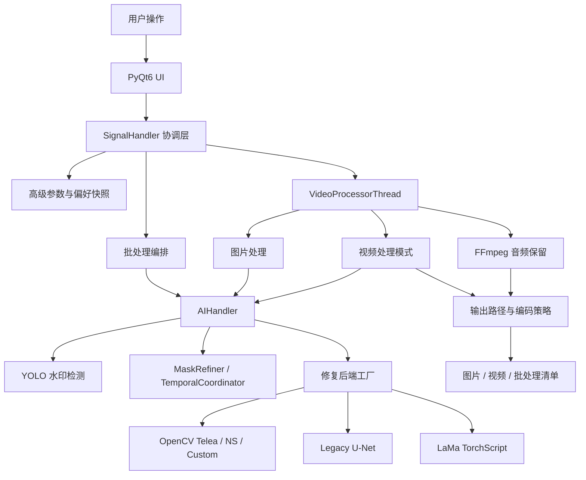

# 智能视频水印去除工具架构文档

> 版本：v0.7.23
> 更新日期：2026-05-04
> 适用范围：当前 `main` 分支本地代码快照
> 主要读者：维护者、功能实现代理、测试与发布负责人

本文档用于回答一个问题：**当前这个项目到底由哪些代码组成，它们如何协同完成图片和视频水印去除。**

旧版文档曾以“完整技术文档”的形式同时承载功能介绍、安装说明、历史版本和旧目录树，内容容易过期。本文件改为架构与代码地图入口，功能介绍继续放在 `README.md`，模型说明放在 `models/README.md`，专题文档和历史报告统一放在 `docs/archive/`。

---

## 1. 当前代码事实快照

### 1.1 代码规模

本次梳理基于本地文件扫描，排除了 `.venv`、`.git`、缓存、构建产物和覆盖率目录。

- `src/app`：117 个 Python 源码文件，约 22,930 行。
- `tests`：114 个 Python 测试文件，约 16,465 行。
- `docs`：77 个 Markdown 文档。
- `scripts/vwr.ps1`：统一 PowerShell 入口，约 94 KB。
- `scripts/vwr.sh`：与 PowerShell 脚本功能对齐的 Bash 交互入口。
- `pyproject.toml`：包元数据版本为 `0.7.23`。
- `src/app/__init__.py`：应用可见版本为 `0.7.23`。

### 1.2 当前定位

项目是一个以 Windows 为主要支持平台的桌面应用，面向图片和视频的水印检测、掩码生成、图像修复、音频保留、批处理与导出追踪。

核心技术栈：

- GUI：`PyQt6`
- 图像处理：`OpenCV`、`NumPy`、`Pillow`
- 检测模型：`Ultralytics YOLO`
- 深度修复：`PyTorch`、内置轻量 U-Net、LaMa TorchScript 后端
- 音视频封装：`FFmpeg` / `ffprobe`
- 工程脚本：`uv`、PowerShell、Bash、`pytest`、`black`、`flake8`、`mypy`、`bandit`

### 1.3 运行入口

- 命令入口：`main.py`
- 包入口：`src/app/entrypoints.py`
- 包脚本：`video-watermark-remover`、`vwr`
- GUI 脚本：`video-watermark-remover-gui`
- 推荐开发入口：`.\scripts\vwr.ps1` 或 `bash scripts/vwr.sh`

启动链路：

```text
main.py
  -> app.entrypoints.main()
  -> setup_logging()
  -> ConfigManager.load_config()
  -> 在导入 PyQt6 前预加载 torch
  -> QApplication
  -> MainWindow(config)
  -> SignalHandler 连接 UI 与处理核心
```

---

## 2. 顶层架构

### 2.1 模块关系



### 2.2 分层说明

- **入口层**：负责启动、日志、配置加载、Qt 应用生命周期。
- **UI 层**：负责文件选择、预览、参数面板、日志、批处理队列、用户交互。
- **协调层**：`SignalHandler` 统一连接 UI 信号、运行参数、处理线程和批处理状态。
- **配置层**：集中处理 `config.ini`、用户偏好、参数校验、运行时解析。
- **核心处理层**：`AIHandler`、视频模式、音频处理、输出策略。
- **工具层**：模型下载、媒体格式、日志、指标、权重检查。
- **测试层**：按 `unit / integration / e2e / future` 主分层维护质量门禁。

---

## 3. 目录职责总览

```text
video_watermark_remover/
  main.py                         # 最薄启动入口
  pyproject.toml                  # 包元数据、依赖、工具配置
  requirements*.txt               # 运行与开发依赖
  scripts/
    vwr.ps1                       # Windows 交互式工程入口
    vwr.sh                        # Bash 交互式工程入口
    README.md                     # 脚本使用说明
  models/
    README.md                     # YOLO / LaMa 模型说明
    *.pt                          # 本地模型权重，属于运行资产
  src/app/
    entrypoints.py                # 应用启动入口
    config/                       # 配置、偏好、参数快照、样式
    core/                         # AI、视频、音频处理核心
    ui/                           # PyQt6 页面、组件、批处理 UI
    utils/                        # 模型下载、日志、指标、格式等工具
  tests/
    unit/                         # 单元测试
    integration/                  # 集成测试
    e2e/ps1/                      # PowerShell 端到端脚本
    future/                       # 未来或暂挂测试
  docs/
    architecture.md               # 当前架构文档
    archive/                      # 归档专题文档与历史报告
    agents/                       # 本地子代理说明，已加入 .gitignore
    plans/                        # 本地计划文档，已加入 .gitignore
```

---

## 4. 源码完整索引

这一节按当前 `src/app` 实际代码分组，说明每组代码承担什么职责。

### 4.1 `src/app/entrypoints.py`

- `main()`：应用启动主函数。
- `_preload_torch_before_pyqt6()`：在 Windows 环境中提前加载 `torch`，降低先导入 Qt DLL 后再导入 PyTorch 时触发 `WinError 1114` 的风险。

### 4.2 `src/app/config`

配置层负责把“静态配置、用户偏好、UI 参数、运行时参数”统一成可传递给核心处理模块的结构。

主要文件：

- `advanced_params.py`
  - 定义 `AdvancedParamsSnapshot`、`ProcessingContext`、`ResolvedPerformanceConfig`、`ResolvedOutputConfig`。
  - 负责处理模式、工作线程数、GPU 显存预算、输出格式、压缩质量、音频保留等运行时解析。
- `config_manager.py`
  - 负责加载、创建和保存 `config.ini`。
  - 提供检测阈值、修复方法、批处理并发、重试次数等配置读取入口。
- `validators.py`
  - 提供参数校验规则，避免 UI 或历史配置写入非法值。
- `preferences_defaults.py`、`preferences_storage.py`、`preferences_validator.py`、`user_preferences_manager.py`
  - 旧入口或兼容入口，继续桥接偏好默认值、存储、校验和管理能力。
- `preferences/`
  - 当前偏好实现的主要包。
  - `defaults.py` 定义默认偏好。
  - `storage.py` 负责 JSON 文件读写和默认值合并。
  - `validator.py` 负责用户偏好安全校验。
  - `manager.py` 负责最近文件、窗口状态、高级参数快照、导入导出和自动保存。
- `styles/`
  - 当前 UI 样式系统。
  - `tokens.py`、`colors.py` 定义基础色彩和 token。
  - `factory.py`、`manager.py` 装配全局样式。
  - `sections/` 拆分按钮、下拉框、输入框、进度条、标签页、主窗口等 QSS 片段。

### 4.3 `src/app/core/ai`

AI 层负责检测水印区域、生成和修正掩码、选择修复后端、执行单帧或批量修复，并把运行痕迹写回处理详情。

主要文件：

- `ai_handler.py`
  - 当前 AI 核心协调器。
  - 负责设备选择、模型加载、运行时参数刷新、单帧处理、批量处理、掩码解析、修复后端选择、fallback、trace 汇总。
- `yolo_detector.py`
  - YOLO 检测器。
  - 支持默认专用模型、`corzent` 微调模型、`yolo11s`、自定义模型路径。
  - 负责检测框、分割 mask、padding、形态学后处理和批量检测。
- `mask_refiner.py`
  - 复杂掩码优化。
  - 处理小噪点、内部孔洞、短线缺口、裂缝桥接等场景。
- `temporal_coordinator.py`
  - 视频时序协调。
  - 负责检测帧间隔、短暂丢检复用、位移确认和强制重检。
- `image_processor.py`
  - 图像预处理与后处理工具，包括模糊、降噪、锐化、边缘平滑、融合和增强。
- `image_inpainter.py`
  - OpenCV 风格修复器，支持 Telea、NS 和自定义质量档。
- `dl_inpainter.py`
  - 内置轻量 U-Net 深度修复器。
  - 支持单帧、真实 batch、按 profile 分组 batch、tile 推理、tile-aware batch、OOM 重试、混合精度和显存预算。
- `lama_runtime.py`
  - LaMa TorchScript 运行时。
  - 负责模型路径解析、输入 pad、FP16 fallback、单帧和批量输出转换。
- `gpu_monitor.py`
  - GPU 显存探测、批大小估算、清理和警告。
- `inpainting_backends/`
  - 修复后端抽象与工厂。
  - `base.py` 定义统一接口。
  - `factory.py` 根据请求创建后端。
  - `opencv_backend.py` 封装 OpenCV 修复。
  - `legacy_unet_backend.py` 封装旧 U-Net 路径。
  - `lama_backend.py` 封装 LaMa ROI、batch、OOM fallback 和 trace。

AI 主链路：

```text
AIHandler.process_frame()
  -> 解析或复用水印 mask
  -> YOLOWatermarkDetector.detect_watermark()
  -> MaskRefiner.refine()
  -> TemporalCoordinator.update()
  -> 根据 mask 和参数选择 OpenCV / U-Net / LaMa
  -> 执行修复与后处理
  -> 汇总 processing_info / trace
```

### 4.4 `src/app/core/video`

视频层负责把图片/视频输入转换为可中断、可进度上报、可音频保留、可输出追踪的处理任务。

主要文件：

- `thread.py`
  - `VideoProcessorThread` 是单文件处理线程。
  - 负责注入模型路径、创建或刷新 `AIHandler`、根据输入类型和运行配置选择处理路径。
  - 对外发出进度、详细进度、预览帧、完成和错误信号。
- `image_processor.py`
  - 图片输入处理入口。
- `runtime_guard.py`
  - 根据输入类型、请求模式和资源限制解析实际视频运行模式。
- `output_strategy.py`
  - 输出路径、图片写入参数、视频编码器、FFmpeg 重新编码参数、音频保留策略。
- `modes/single_process.py`
  - 单进程视频处理。
  - 负责帧读取、检测 batch、逐帧修复、心跳日志和进度。
- `modes/multiprocess.py`
  - 多进程分块处理。
  - 负责切分 chunk、处理队列、合并临时视频、取消清理。
- `modes/pipeline.py`
  - 流水线处理。
  - 负责读帧、处理、写帧三段式管线和队列预算。
- `workers/`
  - `frame_reader.py`：读帧、抽首帧、抽指定帧。
  - `frame_processor.py`：进程内初始化和复用 AIHandler，处理帧任务。
  - `frame_writer.py`：按序写出帧并做自适应等待。
  - `chunk.py`：多进程分块 worker。
  - `audio.py`：异步音频提取。
- `utils/`
  - `backpressure.py`：队列预算、运行模式约束和背压控制。
  - `path.py`：临时路径生成。
  - `resource_pressure.py`：资源耗尽错误识别。

视频运行模式选择简化为：

```text
AdvancedParamsSnapshot.resolve()
  -> ResolvedPerformanceConfig
  -> VideoProcessorThread.run()
  -> runtime_guard.resolve_video_runtime_mode()
  -> single_process / multiprocess / pipeline
```

### 4.5 `src/app/core/audio`

音频层围绕 FFmpeg 封装，目标是在视频水印处理后尽量保留原音频。

主要文件：

- `ffmpeg_detector.py`
  - 查找 `ffmpeg` 和 `ffprobe`，支持配置路径、系统 PATH 和常见路径。
- `video_info_extractor.py`
  - 基于 `ffprobe` 解析视频流、音频流、时长、编码和容器信息。
- `audio_extractor.py`
  - 提取整段音频或片段音频，生成临时音频文件。
- `audio_merger.py`
  - 合并音频和处理后视频，支持替换音轨和多音轨合并。
- `ffmpeg_audio_processor.py`
  - 对外提供音频保留主入口。
  - 在 FFmpeg 不可用或命令失败时执行保守 fallback。

### 4.6 `src/app/ui`

UI 层负责桌面交互，不直接做重型处理；重型任务统一交给处理线程或批处理线程。

主要文件：

- `main_window.py`
  - 主窗口组装。
  - 创建文件面板、预览面板、控制面板、日志面板、批处理控件和高级参数面板。
  - 启动 AI 模型预加载线程，并在关闭时清理处理线程和偏好。
- `signal_handler.py`
  - UI 与业务核心之间的协调中心。
  - 负责导入、导出、主题切换、自动/手动模式、单文件处理、批处理启动/取消、清单导出、运行时参数构建、批处理快照和 JSON 安全转换。
- `components/`
  - `file_panel.py`：文件选择与文件队列入口。
  - `preview_panel.py`：原图/处理后预览、进度预览、视频首帧预览。
  - `control_panel.py`：开始、停止、模式等控制按钮。
  - `log_panel.py`、`log_rendering.py`：日志展示与格式化。
  - `detailed_progress_widget.py`：详细阶段进度。
- `widgets/`
  - `selectable_image_label.py`、`image_selector_widget.py`、`selection_handlers.py`、`coordinate_converter.py`：手动框选区域。
  - `advanced/advanced_parameters_widget.py`：高级参数总面板。
  - `advanced/advanced_parameters_tabs.py`：高级参数页签容器。
  - `advanced/tabs/detection_tab.py`：检测参数。
  - `advanced/tabs/inpainting_tab.py`：修复参数。
  - `advanced/tabs/performance_tab.py`：性能与运行模式参数。
  - `advanced/tabs/output_tab.py`：输出与音频参数。
  - `batch/batch_processing_widget.py`：批处理主控件。
  - `batch/batch_file_manager.py`：批处理文件队列、稳定 `file_id`、状态和详情。
  - `batch/batch_processor_thread.py`：批处理执行线程。
  - `batch/batch_ui_components.py`：批处理 UI 辅助组件。
- `utils/`
  - `ai_params_builder.py`：从 UI 控件构建 AI 参数。
  - `file_dialog_filters.py`：统一图片/视频文件过滤器。

### 4.7 `src/app/utils`

工具层为核心链路提供独立可复用能力。

- `model_downloader.py`
  - YOLO 模型下载、重试、校验、列表和删除命令行入口。
- `inpainting_model_downloader.py`
  - LaMa / legacy inpainting 模型路径解析，支持环境变量、配置和内置候选路径。
- `inpainting_weight_inspector.py`
  - U-Net 权重检查器，可扫描文件或目录并判断权重结构是否匹配当前轻量 U-Net。
- `media_formats.py`
  - 图片和视频扩展名常量。
- `logger_setup.py`
  - 日志初始化。
- `metrics.py`
  - 处理耗时、FPS、ETA、内存快照和报告导出。
- `utils.py`
  - 通用路径和格式化辅助函数。

---

## 5. 参数、配置与数据流

### 5.1 配置来源

运行时参数来自四类来源：

1. `config.ini`：基础默认配置，由 `ConfigManager` 管理。
2. 用户偏好 JSON：窗口状态、最近文件、高级参数、批处理偏好，由 `UserPreferencesManager` 管理。
3. UI 控件：高级参数面板、批处理面板、控制面板。
4. 任务上下文：输入文件类型、CPU 数量、是否批处理、资源限制。

### 5.2 参数真源

当前高级参数以 `AdvancedParamsSnapshot` 为主要真源：

```text
UI 控件 / 用户偏好 / legacy 字段
  -> AdvancedParamsSnapshot.from_dict()
  -> resolve_output_config()
  -> resolve(ProcessingContext)
  -> to_ai_params() / to_batch_config() / to_manifest_dict()
```

这套模型把以下参数集中管理：

- 检测阈值、YOLO 模型、mask padding、形态学参数。
- 修复后端、质量、半径、LaMa / legacy U-Net 资源路径。
- 处理模式、worker 数、GPU 显存预算、缓存预算。
- 输出格式、压缩质量、后缀、时间戳、音频保留。
- 复杂 mask 和视频时序协调参数。

### 5.3 输出参数链路

输出参数不应由不同模块各自拼接。当前统一入口是：

```text
AdvancedParamsSnapshot.resolve_output_config()
  -> ResolvedOutputConfig
  -> core.video.output_strategy.resolve_output_path()
  -> 图片写入参数 / 视频编码策略 / FFmpeg 参数
```

---

## 6. 单文件处理链路

### 6.1 图片

```text
用户导入图片
  -> SignalHandler.handle_start_processing()
  -> AIParamsBuilder.build_from_ui()
  -> VideoProcessorThread(..., input_path)
  -> core.video.image_processor.process_image()
  -> AIHandler.process_frame()
  -> output_strategy.build_image_write_params()
  -> 写出图片
```

关键点：

- 图片路径仍复用 `VideoProcessorThread`，这样 UI 进度和取消链路保持一致。
- 图片输出参数通过 `output_strategy` 统一解析。
- 预览面板会加载处理后的图片并展示 `processing_info`。

### 6.2 视频

```text
用户导入视频
  -> SignalHandler.handle_start_processing()
  -> 解析性能参数和输出参数
  -> VideoProcessorThread.run()
  -> runtime_guard 决定实际模式
  -> single_process / multiprocess / pipeline
  -> AIHandler 逐帧或批量处理
  -> FFmpegAudioProcessor 尝试保留音频
  -> 输出视频
```

关键点：

- `auto` 模式不是硬编码某一个实现，而是根据输入和运行上下文解析为实际模式。
- 多进程和流水线模式需要资源护栏，资源压力或输入不适配时会降级。
- 音频保留失败时，处理结果仍优先保留无音频视频，不直接丢弃主结果。

---

## 7. 批处理架构

批处理链路由 UI 队列、稳定文件身份、批处理线程和清单导出组成。

```text
BatchProcessingWidget
  -> BatchFileManager 维护队列和 file_id
  -> SignalHandler._start_batch_processing()
  -> BatchProcessorThread
  -> 每个文件构建独立 runtime payload
  -> 调用单文件处理能力
  -> 回写状态、进度、输出路径、processing_details
  -> export_batch_manifest()
```

当前设计重点：

- 文件身份使用稳定 `file_id`，避免队列重排或删除后按索引误写。
- 批处理参数会按文件构建运行时 payload，支持单文件级输出参数。
- 清单导出包含队列摘要、运行参数来源、运行模式摘要和文件级处理详情。
- 取消场景需要同时处理 UI 状态、线程停止、等待中任务标记和快照保留。

---

## 8. 模型与运行资产

### 8.1 当前模型目录

`models/` 当前是运行资产目录，不属于源码模块。当前本地存在：

- `big-lama.pt`
- `yolo11x-watermark.pt`
- `yolo11x-watermark-corzent.pt`

`models/README.md` 是模型使用说明和下载入口。

### 8.2 YOLO 模型管理

`ModelDownloader.MODELS` 管理可自动下载的 YOLO 权重。检测器根据 `model_type` 决定：

- 使用现有本地权重。
- 自动下载缺失模型。
- 校验 SHA256。
- 在 `corzent` 等可选模型不可用时回退到默认模型。

### 8.3 深度修复模型管理

LaMa 和 legacy U-Net 路径由 `inpainting_model_downloader.py`、配置项和环境变量共同解析。

脚本层 `vwr.ps1` / `vwr.sh` 会在启动前提供 LaMa TorchScript 权重提示，避免用户启动后才发现深度修复不可用。

---

## 9. 工程脚本与开发入口

`scripts/vwr.ps1` 是当前 Windows 开发和运行的统一入口，`scripts/vwr.sh` 是 Linux / macOS / Git Bash 下的对应入口。两个脚本都保持纯交互式菜单模式。

主要能力：

- 环境初始化：创建 `.venv`、安装运行/开发依赖、处理 uv 索引源、执行 editable install 或 `.pth` fallback。
- 启动程序：启动前检查配置、模型和常见依赖问题。
- 质量检查：格式、风格、类型、安全检查。
- 测试：`unit / integration / all / audio / preferences / e2e / quality`。
- 覆盖率、性能测试、打包构建。
- 分级清理缓存和临时目录。
- CI 模式。

注意：

- `scripts/README.md` 已说明旧尾参命令形式移除，并列出 PowerShell / Bash 两种入口。
- 项目文档和 README 中推荐的脚本命令应优先保持与这个交互式入口一致。

---

## 10. 测试体系

当前测试主分层：

- `tests/unit/`
  - 单元测试。
  - 覆盖配置、参数模型、AI 小模块、视频模块拆分、UI 组件轻量行为等。
- `tests/integration/`
  - 集成测试。
  - 覆盖 AI、视频处理、UI、运行时和历史 phase3 场景。
- `tests/e2e/ps1/`
  - PowerShell 端到端脚本。
- `tests/future/`
  - 暂挂或未来阶段测试，不属于默认质量门禁。

推荐快速验证：

```powershell
.\scripts\vwr.ps1
```

```bash
bash scripts/vwr.sh
```

在菜单中选择“运行测试”，再选择 `unit` 并启用 `Quick`。

直接命令式验证可参考 `tests/TESTING_GUIDE.md`，例如：

```powershell
.\.venv\Scripts\python.exe -m pytest tests/unit -q
```

对文档或轻量结构改动，通常不需要运行完整视频、GPU、E2E 或集成测试。若改到处理核心、批处理或脚本，应至少运行相关单元切片，并视风险补集成测试。

---

## 11. 文档体系

当前文档职责建议如下：

- `README.md`
  - 面向用户和新维护者的快速介绍、安装运行、功能特性和文档索引。
- `docs/architecture.md`
  - 当前架构、代码地图、数据流、模块边界和维护风险。
- `models/README.md`
  - 模型说明、下载方式、推荐配置。
- `scripts/README.md`
  - PowerShell / Bash 工程入口说明。
- `tests/TESTING_GUIDE.md`
  - 测试分层和推荐执行方式。
- `docs/archive/`
  - 归档专题文档、历史分析、权重检查和候选模型筛选报告。
- `docs/agents/`、`docs/plans/`
  - 本地协作与计划目录，已加入 `.gitignore`，不再作为公开文档入口。

---

## 12. 维护风险与改造重点

### 12.1 高耦合协调文件

以下文件承担协调职责，改动前应先定位调用链并补充定向测试：

- `src/app/ui/signal_handler.py`
  - 同时协调文件导入、单文件处理、批处理、参数构建、清单导出和文件管理器打开。
  - 风险是索引、线程状态和 UI 状态容易相互影响。
- `src/app/core/ai/ai_handler.py`
  - 同时协调检测、mask、修复后端、fallback、trace 和 batch。
  - 风险是参数字段遗漏会导致 UI、批处理和清单不一致。
- `scripts/vwr.ps1` / `scripts/vwr.sh`
  - 承载环境、运行、测试、质量、打包、清理和 CI。
  - 风险是交互式入口和测试脚本约定不一致。

### 12.2 可选依赖与运行环境

- `torch`、`ultralytics`、`PyQt6`、`cv2` 都可能造成导入成本或环境依赖问题。
- 轻量测试应优先使用 stub、导入边界测试或语法烟囱。
- GPU、LaMa、FFmpeg 相关测试应明确环境前提，不要混入普通文档或 UI 改动验证。

### 12.3 文档易过期点

文档中应避免长期写死以下内容：

- 精确源码行数。
- 具体模型性能 FPS。
- 旧目录树。
- 已迁移的脚本尾参命令。
- 历史阶段名称作为当前能力描述。

如果确需写入，应标注统计日期和口径。

---

## 13. 扩展指南

### 13.1 新增检测模型

优先修改：

- `src/app/utils/model_downloader.py`
- `src/app/core/ai/yolo_detector.py`
- `models/README.md`
- 相关配置和测试。

注意保持：

- `model_type` 配置可校验。
- 本地权重、自动下载、校验失败和 fallback 都有清晰行为。
- UI 文案与配置文档同步。

### 13.2 新增修复后端

优先接入：

- `src/app/core/ai/inpainting_backends/base.py`
- `src/app/core/ai/inpainting_backends/factory.py`
- 新 backend 文件。
- `src/app/core/ai/ai_handler.py` 的选择和 trace 汇总。
- 高级参数默认值、UI 控件和测试。

注意保持：

- `load()`、`inpaint_frame()`、`get_last_trace()` 行为统一。
- 后端不可用时能回退。
- 批处理和清单能记录实际使用后端。

### 13.3 新增视频处理模式

优先修改：

- `src/app/config/advanced_params.py`
- `src/app/core/video/runtime_guard.py`
- `src/app/core/video/thread.py`
- `src/app/core/video/modes/`
- 相关单元和集成测试。

注意保持：

- `auto` 模式解析可解释。
- 图片输入不应误进入视频模式。
- 资源压力、取消和临时文件清理有明确路径。

### 13.4 新增 UI 参数

优先同步：

- `src/app/config/advanced_params.py`
- `src/app/config/preferences/defaults.py`
- `src/app/config/preferences/validator.py`
- `src/app/ui/widgets/advanced/tabs/*.py`
- `src/app/ui/utils/ai_params_builder.py`
- `src/app/ui/signal_handler.py`
- 对应测试和 README 或专题文档。

注意保持：

- 默认值、重置默认值、偏好读取、参数构建、运行时消费五处一致。
- 批处理路径不能遗漏。
- 清单导出要能追溯。

---

## 14. 修改前检查清单

涉及不同区域时建议使用不同验证策略：

- 只改文档：检查链接、旧文件名残留、关键章节完整性。
- 改配置或参数模型：运行相关 `tests/unit/app/config` 和高级参数测试。
- 改 UI：运行对应 UI 单测，并视情况做真实窗口冒烟。
- 改 AI：运行 `tests/unit/core/ai` 定向测试，必要时补集成测试。
- 改视频模式：运行视频模块拆分、模式、输出策略相关测试。
- 改批处理：运行 batch、manifest、取消、file_id 相关测试。
- 改脚本：运行脚本语法校验和相关单测或 E2E 切片，避免超过 60 秒的无界等待。

---

## 15. 快速定位索引

- 应用启动失败：先看 `src/app/entrypoints.py`、`ConfigManager`、日志初始化和 PyTorch 预加载。
- UI 按钮无响应：先看 `MainWindow._connect_signals()` 和 `SignalHandler` 对应 `handle_*` 方法。
- 参数没有生效：先看 `AdvancedParamsSnapshot`、`AIParamsBuilder`、`SignalHandler` 运行时 payload。
- 检测不准：先看 `YOLOWatermarkDetector`、模型配置、mask padding 与后处理。
- 修复效果不稳：先看 `AIHandler` 后端选择、`MaskRefiner`、LaMa 或 OpenCV trace。
- 视频很慢：先看 `ResolvedPerformanceConfig`、`runtime_guard`、`single_process`、batch 检测和 GPU 预算。
- 批处理状态错乱：先看 `BatchFileManager`、稳定 `file_id`、`BatchProcessorThread` 和 `SignalHandler` 回写逻辑。
- 音频丢失：先看 `FFmpegAudioProcessor`、`FFmpegDetector`、`output_strategy.should_preserve_audio()`。
- 清单字段缺失：先看 `SignalHandler.handle_export_batch_manifest()` 和 `_make_json_safe()`。

---

## 16. 本次文档重命名说明

旧文件名：

```text
docs/complete-technical-documentation.md
```

新文件名：

```text
docs/architecture.md
```

重命名理由：

- 文件名更短，符合实际用途。
- 仓库中已有专题文档引用 `docs/architecture.md`，新名称可以修复这个历史断链。
- 文档内容从“完整技术文档”调整为“架构与代码地图”，不再混放用户指南和版本流水账。
