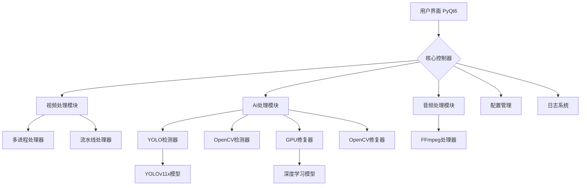

# 智能视频水印去除工具 - 完整技术文档 🎬

> **版本**: v0.5.0 | **更新日期**: 2025-12-07 | **Python**: 3.12.10 | **代码量**: ~28,000+ 行

基于深度学习和传统图像处理技术的智能视频水印去除工具，支持图片和视频文件的水印智能检测与高质量去除。

---

## 📋 目录

- [核心功能](#核心功能)
- [技术架构](#技术架构)
- [系统要求](#系统要求)
- [安装部署](#安装部署)
- [使用指南](#使用指南)
- [项目结构](#项目结构)
- [开发测试](#开发测试)
- [配置说明](#配置说明)
- [版本历史](#版本历史)
- [贡献指南](#贡献指南)

---

## ✨ 核心功能

### 🔥 主要功能特性

#### 水印检测
- **🤖 YOLO深度学习检测**: 基于YOLOv11x-Watermark专用模型的水印区域智能检测（>99%准确率）⭐
- **🎨 传统算法检测**: 基于OpenCV多重算法融合的水印检测
  - Canny边缘检测 - 识别文字和图形边界
  - 色彩分析 - 检测均匀色彩区域和半透明效果
  - 形态学优化 - 自动去除噪声，精确定位水印

#### 水印去除与修复
- **⚡ GPU加速修复**: 深度学习图像修复，支持CUDA加速
- **🛠️ 多算法自适应修复**:
  - 小面积 (<5%): 自定义插值算法，高质量填充
  - 中等面积 (5-15%): TELEA快速行进法，平衡效果与速度
  - 大面积 (≥15%): Navier-Stokes方法，处理复杂水印

#### 文件处理
- **📁 多格式支持**:
  - 图片: JPG, JPEG, PNG, BMP
  - 视频: MP4, AVI, MKV, MOV
- **🎵 音频完整保留**: 集成FFmpeg，自动提取并合并音频轨道
- **📦 批量队列处理**: 支持多文件批量处理，智能队列管理

#### 用户交互
- **🖱️ 手动精确选择**: 支持鼠标拖拽框选水印区域，像素级精确控制
- **👁️ 实时预览对比**: 处理前后效果实时对比
- **📊 详细进度跟踪**: 多维度进度显示（总体进度、帧进度、处理速度）

#### 界面体验
- **🎨 现代化UI**: 基于PyQt6的专业界面设计
- **🌓 主题切换**: Light/Dark双主题支持，Light主题为默认
  - Light主题: 柔和蓝灰绿色调(#89A4B7, #96B3AE, #CEE3DF)
  - Dark主题: 经典深色护眼配色
- **⚙️ 用户偏好**: 自动保存设置、窗口位置、最近文件等

### 🚀 高级功能

- **多处理模式**: 单进程/多进程分块/流水线三种处理策略
- **智能设备适配**: 自动检测GPU（CUDA）可用性
- **高级参数控制**: 检测敏感度、修复方法、输出质量等可调
- **错误恢复机制**: 单帧失败不影响整体处理

---

## 🛠️ 技术架构

### 核心技术栈

#### GUI与基础框架
- **PyQt6** >= 6.6.0 - 现代化GUI框架
- **Python** 3.12.10 - 核心开发语言
- **uv** - 现代化Python包管理和虚拟环境工具

#### 图像处理
- **OpenCV** >= 4.8.0 - 图像处理核心
- **NumPy** >= 1.25.0 - 高效数值计算
- **Pillow** >= 10.0.0 - 图像格式支持

#### 深度学习
- **PyTorch** >= 2.6.0 - AI框架
- **torchvision** >= 0.21.0 - 视觉模型库
- **Ultralytics** >= 8.3.0 - YOLOv11x实现

#### 多媒体处理
- **FFmpeg** - 音频提取与合并（外部依赖）

#### 开发工具
- **pytest** >= 7.0.0 - 测试框架
- **pytest-qt** >= 4.2.0 - Qt组件测试
- **black** - 代码格式化
- **flake8** - 代码风格检查
- **mypy** - 类型注解检查
- **bandit** - 安全漏洞扫描

### 架构设计原则

#### 🏗️ 模块化架构
- **单一职责**: 每个模块专注一个功能
- **低耦合高内聚**: 组件间通过信号槽解耦
- **可扩展性**: 检测器和修复器可独立扩展

#### 🔄 设计模式
- **观察者模式**: PyQt6信号槽机制
- **策略模式**: 视频处理三种策略可切换
- **工厂模式**: AI参数构建器
- **单例模式**: 配置管理器、偏好设置管理器

#### 📂 分层架构
```
用户交互层 (UI)
    ↓
业务逻辑层 (Core)
    ↓
数据访问层 (Config/Models)
```

### 系统架构图



---

## 💻 系统要求

### 硬件要求
- **CPU**: 多核处理器（推荐4核及以上）
- **内存**: 8GB+ RAM（推荐16GB）
- **硬盘**: 2GB+ 可用空间（含模型文件）
- **GPU**: NVIDIA GPU with CUDA 11.8+（可选，用于加速）

### 软件要求
- **操作系统**:
  - Windows 10/11 (主要支持) ✅
  - Linux (Ubuntu 20.04+)
  - macOS (10.15+)
- **Python**: 3.12.10
- **uv**: 最新版本（用于包管理和虚拟环境）
- **FFmpeg**: 最新稳定版（必需）

### 依赖环境
- **CUDA**: 11.8+ (GPU加速必需)
- **cuDNN**: 对应版本 (GPU加速必需)

---

## 📦 安装部署

### 方式一：自动化脚本安装（推荐）⭐

**Windows平台（PowerShell）**:
```powershell
# 1. 克隆或下载项目到本地
cd C:\cascadeProjects\video_watermark_remover

# 2. 运行环境初始化脚本（仅首次运行）
.\scripts\vwr.ps1 setup

# 3. 启动应用
.\scripts\vwr.ps1 run
```

**自动完成内容**:
- ✅ 检查并安装uv包管理器
- ✅ 使用uv创建.venv虚拟环境（Python 3.12.10）
- ✅ 使用uv安装所有核心依赖和开发工具
- ✅ 下载YOLOv11x-Watermark模型

> 说明：仓库当前仅提供 Windows PowerShell 脚本（统一入口：`.\scripts\vwr.ps1`）；Linux/macOS 可按“手动安装（使用uv）”运行。

### 方式二：手动安装（使用uv）

```bash
# 1. 克隆项目
git clone [repository_url]
cd video_watermark_remover

# 2. 安装uv（如果尚未安装）
# Windows (PowerShell):
powershell -ExecutionPolicy ByPass -c "irm https://astral.sh/uv/install.ps1 | iex"
# Linux/macOS:
curl -LsSf https://astral.sh/uv/install.sh | sh

# 3. 使用uv创建Python 3.12.10虚拟环境
uv venv --python 3.12.10

# 4. 激活虚拟环境
# Windows:
.\.venv\Scripts\activate
# Linux/macOS:
source .venv/bin/activate

# 5. 使用uv安装依赖
uv pip install -r requirements.txt

# 6. 配置FFmpeg
# 确保ffmpeg命令在系统PATH中可用

# 7. 下载模型（可选，首次运行时自动下载）
# YOLOv11x-Watermark模型会在首次使用时自动下载

# 8. 运行程序
uv run python main.py
```

### 开发环境配置

```bash
# 使用uv安装开发依赖
uv pip install -r requirements-dev.txt

# 安装pre-commit hooks
pre-commit install

# 运行代码质量检查
.\scripts\vwr.ps1 quality

# 运行测试
.\scripts\vwr.ps1 test unit -Quick
```

### 验证安装

```powershell
# 运行快速测试
.\scripts\vwr.ps1 test unit -Quick

# 检查代码质量
.\scripts\vwr.ps1 quality -Quick

# 启动应用
uv run python main.py
```

**安装成功标志**:
- ✅ 应用正常启动，显示Light主题界面
- ✅ 窗口标题显示"智能水印去除工具 - v0.5.0"
- ✅ 所有面板正常显示（文件、预览、控制、日志）
- ✅ 能够选择文件并显示预览

---

## 📖 使用指南

### 快速开始

#### 单文件处理

1. **启动应用**
   ```bash
   uv run python main.py
   ```

2. **选择文件**
   - 点击"📂 选择文件"按钮
   - 或拖拽文件到界面
   - 支持格式：JPG/PNG/BMP (图片), MP4/AVI/MKV/MOV (视频)

3. **选择处理模式**
   - **自动检测**:
     - 选择"自动检测模式"
     - AI自动识别水印区域
     - 推荐用于常见水印类型
   - **手动选择**:
     - 切换到"手动选择"标签
     - 用鼠标拖拽框选水印区域
     - 适合精确控制

4. **调整参数**（可选）
   - 在"高级参数"面板调整：
     - 检测敏感度: 0.0-1.0
     - 修复方法: TELEA/Navier-Stokes/自动
     - 输出质量: 低/中/高
     - GPU加速: 开启/关闭/自动

5. **开始处理**
   - 点击"✨ 开始处理"按钮
   - 查看实时进度和日志
   - 预览处理效果

6. **导出结果**
   - 处理完成后自动保存
   - 默认文件名: 原文件名_processed.扩展名

#### 批量处理

1. **切换到批量模式**
   - 选择多个文件（Ctrl+鼠标点击）
   - 或点击"添加到队列"批量添加

2. **配置批量参数**
   - 设置统一的处理参数
   - 选择并发处理数量（1-4）
   - 开启/关闭自动重试

3. **开始批量处理**
   - 点击"开始批量处理"
   - 监控队列进度
   - 查看每个文件的状态

4. **查看批量结果**
   - 完成数量统计
   - 失败文件列表
   - 批量导出结果

### 处理效果预期

#### ✅ 效果良好的水印类型
- 📝 文字水印（特别是单色文字）
- 🎨 简单图标和Logo
- 👁️ 半透明叠加效果
- ✨ 小面积装饰性水印（<5%画面）
- 🔤 字幕水印
- 📍 角落固定位置水印

#### ⚠️ 处理效果有限的情况
- 🌈 复杂多色图形水印
- 🎭 与背景融合度极高的水印
- 📏 覆盖面积过大的水印（>30%）
- 💫 动态或闪烁效果的水印
- 🔄 旋转或变形的水印

### 高级使用技巧

#### 手动选择精确控制
```
1. 切换到"手动选择"标签
2. 使用鼠标拖拽框选水印区域
3. 可以选择多个区域（按住Ctrl）
4. 支持调整选框大小
5. 支持删除已选区域
```

#### 参数优化建议
```
场景                   推荐设置
─────────────────────────────────────
文字水印               检测敏感度: 0.6-0.8
                      修复方法: TELEA

Logo水印               检测敏感度: 0.5-0.7
                      修复方法: 自动

大面积水印             检测敏感度: 0.4-0.6
                      修复方法: Navier-Stokes

复杂背景               检测敏感度: 0.7-0.9
                      修复方法: 自动
```

#### 日志分析
处理日志提供详细信息：
- 🔍 检测到的水印区域数量和位置
- 🎨 使用的修复算法类型
- ⏱️ 处理耗时统计
- 📊 帧处理进度
- ❌ 错误和警告信息

---

## 📁 项目结构

### 目录结构

```
video_watermark_remover/
├── app/                          # 应用核心代码 (11,949行)
│   ├── core/                     # 核心功能模块 (5,245行)
│   │   ├── ai/                   # AI处理 (1,389行)
│   │   │   ├── ai_handler.py     # AI协调器 (376行)
│   │   │   ├── yolo_detector.py  # YOLO检测 (277行)
│   │   │   ├── image_inpainter.py # OpenCV修复 (274行)
│   │   │   └── dl_inpainter.py   # GPU修复 (408行)
│   │   ├── audio/                # 音频处理 (1,850行)
│   │   │   ├── ffmpeg_audio_processor.py (326行)
│   │   │   ├── audio_extractor.py (267行)
│   │   │   ├── audio_merger.py (286行)
│   │   │   └── video_info_extractor.py (249行)
│   │   ├── video/                # 视频处理 (1,609行)
│   │   │   └── video_processor.py (1609行)
│   │   └── exceptions.py         # 异常体系 (453行)
│   │
│   ├── ui/                       # 用户界面 (3,843行)
│   │   ├── components/           # UI组件 (1,559行)
│   │   │   ├── file_panel.py (122行)
│   │   │   ├── control_panel.py (254行)
│   │   │   ├── preview_panel.py (486行)
│   │   │   └── log_panel.py (217行)
│   │   ├── widgets/              # 自定义控件 (1,656行)
│   │   │   ├── advanced/         # 高级参数 (619行)
│   │   │   ├── batch/            # 批处理 (1,037行)
│   │   │   └── image_selector_widget.py (136行)
│   │   ├── main_window.py        # 主窗口 (314行)
│   │   └── signal_handler.py     # 信号处理 (556行)
│   │
│   ├── config/                   # 配置管理 (1,774行)
│   │   ├── config_manager.py (224行)
│   │   ├── preferences/ (748行)
│   │   └── styles/ (796行)
│   │
│   └── utils/                    # 工具函数 (148行)
│       ├── logger_setup.py (78行)
│       ├── utils.py (70行)
│       └── model_downloader.py   # 模型下载器
│
├── tests/                        # 测试代码 (5,508行, 29个文件)
│   ├── unit/                     # 单元测试
│   ├── integration/              # 集成测试
│   └── conftest.py               # pytest配置
│
├── scripts/                      # 自动化脚本 (20个)
│   ├── PowerShell/               # Windows脚本
│   │   ├── setup.ps1
│   │   ├── start.ps1
│   │   ├── test.ps1
│   │   └── check-quality.ps1
│   └── Bash/                     # Unix脚本
│       ├── setup.sh
│       ├── run.sh
│       └── test.sh
│
├── docs/                         # 文档 (8,591行, 16个)
│   ├── architecture.md (767行)
│   ├── api.md (1,004行)
│   ├── development.md (801行)
│   └── testing.md (718行)
│
├── models/                       # AI模型
│   ├── yolo11x-watermark.pt (114MB)
│   └── README.md
│
├── logs/                         # 运行日志
├── config.ini                    # 应用配置
├── main.py                       # 程序入口
├── requirements.txt              # 生产依赖
├── requirements-dev.txt          # 开发依赖
└── README.md                     # 项目说明
```

### 📊 代码统计

| 维度 | 数据 | 说明 |
|------|------|------|
| **总代码量** | ~28,000+ 行 | 完整项目 |
| **应用代码** | 11,949 行 | 47个文件 |
| **测试代码** | 5,508 行 | 29个文件 |
| **文档** | 8,591 行 | 16个文档 |
| **脚本** | 1 个 | 统一入口：`scripts/vwr.ps1` |
| **Python文件** | 76 个 | 应用47 + 测试29 |
| **代码规范率** | 79.7% | ≤300行/文件 |

---

## 🧪 开发测试

### 运行测试

#### 使用自动化脚本（推荐）

```powershell
# 运行所有测试
.\scripts\vwr.ps1 test all

# 仅运行单元测试
.\scripts\vwr.ps1 test unit

# 生成覆盖率报告
.\scripts\vwr.ps1 coverage

# 运行特定测试（示例：按名称过滤）
.\.venv\Scripts\python.exe -m pytest -k test_config_manager

# 快速测试（跳过耗时检查）
.\scripts\vwr.ps1 test unit -Quick
```

#### 手动运行测试

```bash
# 激活虚拟环境后运行测试
# 运行所有测试
pytest tests/ -v

# 运行单元测试
pytest tests/unit/ -v

# 运行特定测试文件
pytest tests/unit/test_config_manager.py -v

# 生成覆盖率报告
pytest tests/ --cov=app --cov-report=html

# 运行性能测试
pytest tests/ -m performance
```

### 代码质量检查

```powershell
# 运行所有质量检查
.\scripts\vwr.ps1 quality

# 自动修复格式问题
.\scripts\vwr.ps1 quality -Fix

# 快速检查（跳过类型检查）
.\scripts\vwr.ps1 quality -Quick

# 仅检查特定类型
.\scripts\vwr.ps1 quality -Check format   # 代码格式
.\scripts\vwr.ps1 quality -Check style    # 代码风格
.\scripts\vwr.ps1 quality -Check type     # 类型注解
.\scripts\vwr.ps1 quality -Check security # 安全检查
```

### 测试覆盖情况

**测试统计**:
- 📊 **测试文件**: 29个
- 📊 **测试代码**: 5,508行
- 📊 **测试类型**: 单元测试 + 集成测试 + UI测试 + 性能测试

**主要测试模块**:
- ✅ **单元测试**: ConfigManager, ImageInpainter, Exceptions
- ✅ **AI模块**: YOLO检测器、GPU修复器、AI处理器
- ✅ **视频处理**: 单进程、多进程、流水线处理
- ✅ **UI组件**: 界面组件、批处理、预览
- ✅ **集成测试**: 完整处理流程、音频处理

**代码质量工具**:
- ✅ **Black** - 代码格式化 (行长100)
- ✅ **Flake8** - 代码风格检查
- ✅ **MyPy** - 类型注解检查
- ✅ **Bandit** - 安全漏洞检查
- ✅ **pytest-cov** - 覆盖率分析

**测试覆盖率**: ≥60% (核心模块)

---

## 🔧 配置说明

### 主配置文件 (config.ini)

```ini
[Paths]
ffmpeg_path = ffmpeg
default_model_dir = ./models
last_input_dir =
last_output_dir =

[Processing]
default_detection_sensitivity = 0.5
default_inpainting_method = auto
preserve_audio = yes
output_quality = high
gpu_acceleration = auto

[YOLO]
model_type = yolo11x-watermark
conf_threshold = 0.25
iou_threshold = 0.45
batch_size = 8
auto_download_model = yes

[Logging]
log_level = INFO
log_file_path = logs/app.log
console_logging = yes
max_log_size_mb = 10
backup_count = 5

[UI]
default_theme = light
default_window_width = 1400
default_window_height = 900

[Advanced]
max_threads = -1
cache_size_mb = 512
enable_cache = yes
```

### 用户偏好设置

用户偏好自动保存在：
- **Windows**: `%USERPROFILE%\.video_watermark_remover\user_preferences.json`
- **Linux/macOS**: `~/.config/video_watermark_remover/user_preferences.json`

**保存的设置**:
- 窗口大小和位置
- 最近使用的文件路径
- 主题选择（light/dark）
- 高级参数设置
- 批量处理配置

### 主题配色

**Light主题（默认）**:
- 主色调: `#526F85` (深蓝灰)
- 背景色: `#CEE3DF` (浅灰绿)
- 边框色: `#96B3AE` (灰绿)
- 警告色: `#F2A64C` (橙色)
- 错误色: `#E6664E` (红橙)

**Dark主题**:
- 主色调: `#2196F3` (亮蓝)
- 背景色: `#212121` (深灰)
- 边框色: `#555555` (中灰)

---

## 🎉 版本历史

### v0.5.0 (当前版本 - 2025-12-07)

**重大更新**:
- 🎨 **Light主题优化**:
  - Light主题设为默认主题
  - 全新柔和蓝灰绿配色方案
  - 优化文字可读性和视觉协调性
- ✅ **UI细节优化**:
  - 统一GroupBox标题背景（透明自适应）
  - 优化日志面板颜色一致性
  - 调整控件尺寸和间距
- 🔧 **技术升级**:
  - 统一使用Python 3.12.10
  - 采用uv作为包管理和虚拟环境工具
- 📝 **版本号升级**: v0.4.0 → v0.5.0

### v0.4.0 (2025-11-22)

**核心功能升级**:
- ✅ **Phase 6+**: 集成YOLOv11x-Watermark专用检测模型
- ✅ **Phase 5**: GPU加速深度学习修复
- ✅ **Phase 4**: 多进程分块和流水线处理

**代码质量**:
- ✅ 修复AIHandler接口问题
- ✅ 重构代码架构
- ✅ 完善异常处理体系（13种）
- ✅ 优化音频处理模块化

**功能改进**:
- ✅ 优化批量处理功能
- ✅ 完善用户偏好系统
- ✅ 添加深色/浅色主题
- ✅ 修复VideoWriter兼容性

**开发工具**:
- ✅ 完善20个自动化脚本
- ✅ 建立完整测试体系（29个测试文件）
- ✅ 集成代码质量检查工具链

### v0.3.0 (2025-09-06)

**架构重构**:
- ✅ 完成模块化重构
- ✅ UI组件化设计
- ✅ 信号处理器解耦

**功能完善**:
- ✅ 手动区域选择
- ✅ 预览对比功能
- ✅ 批量处理队列

### v0.2.0 (2024-Q4)

**AI集成**:
- ✅ OpenCV水印检测
- ✅ 多算法自适应修复
- ✅ FFmpeg音频处理
- ✅ 多线程处理架构

### v0.1.0 (2024-Q3)

**基础功能**:
- ✅ PyQt6 GUI框架
- ✅ 文件选择和预览
- ✅ 基础图像处理

---

## 🤝 贡献指南

### 开发规范

**代码规范**:
- 遵循Python PEP8规范
- 每个模块不超过300行（硬性指标）
- 使用类型注解提高可读性
- 添加docstring文档

**测试要求**:
- 添加适当的单元测试
- 测试覆盖率 ≥60%
- 运行所有测试确保通过

**提交检查**:
```powershell
# 提交前必须运行
.\scripts\vwr.ps1 quality
.\scripts\vwr.ps1 test unit -Quick

# 如有问题，自动修复
.\scripts\vwr.ps1 quality -Fix
```

### 功能扩展

**检测器扩展**: `app/core/ai/`
```python
# 创建新的检测器
class NewDetector:
    def detect(self, frame):
        # 实现检测逻辑
        pass
```

**修复器扩展**: `app/core/ai/`
```python
# 创建新的修复器
class NewInpainter:
    def inpaint(self, frame, mask):
        # 实现修复逻辑
        pass
```

**UI组件扩展**: `app/ui/widgets/`
```python
# 创建新的UI组件
class NewWidget(QWidget):
    def __init__(self):
        # 实现UI逻辑
        pass
```

### 架构原则

- ✅ **单一职责**: 每个模块一个功能
- ✅ **开放封闭**: 对扩展开放，对修改封闭
- ✅ **依赖倒置**: 依赖抽象而非具体
- ✅ **接口隔离**: 使用最小化接口
- ✅ **组合优于继承**: 优先组合

---

## 📄 许可证

本项目采用MIT许可证。

---

## 🙏 致谢

**核心依赖**:
- [PyQt6](https://www.qt.io/qt-for-python) - GUI框架
- [OpenCV](https://opencv.org/) - 图像处理
- [PyTorch](https://pytorch.org/) - 深度学习
- [Ultralytics](https://github.com/ultralytics/ultralytics) - YOLO实现
- [FFmpeg](https://ffmpeg.org/) - 多媒体处理
- [uv](https://github.com/astral-sh/uv) - Python包管理工具

**开发工具**:
- [pytest](https://pytest.org/) - 测试框架
- [Black](https://github.com/psf/black) - 代码格式化
- [Flake8](https://flake8.pycqa.org/) - 风格检查
- [MyPy](http://mypy-lang.org/) - 类型检查

---

**智能视频水印去除工具** - 让视频内容更纯净 ✨

*文档版本: v0.5.0 | 最后更新: 2025-12-07 | Python: 3.12.10*
