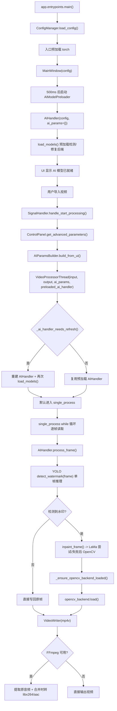
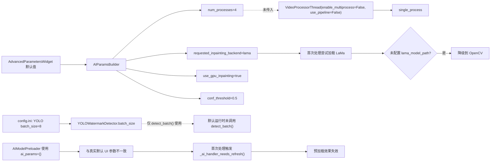

# 默认参数下视频处理缓慢探索与修复计划

> 说明：本文为本次问题的统一主文档。`docs/video-processing-slow-investigation-20260325.md` 为阶段性重复草稿，当前仅保留作过程留痕，暂未删除。

## 1. 摘要结论

在当前默认参数下，单文件视频处理之所以“特别慢”，不是单一慢点，而是四个主因交织：

1. 启动阶段的 AI 预加载几乎没有在首次处理时真正复用，导致用户点击开始后仍然重新构建 `AIHandler` 并再次加载模型。
2. 单文件视频默认始终走单进程逐帧处理，UI 中的 `thread_count`、YOLO `batch_size=8`、多进程/流水线能力没有真正进入默认业务流。
3. OpenCV 修复后端在逐帧处理中存在重复 `load()` 的生命周期问题，命中水印时会反复执行 backend 加载与日志输出。
4. “默认参数”并不是单一来源，UI 默认值会覆盖 `config.ini.example` 的示例值；例如模板里的 `conf_threshold=0.25`，在真实默认运行时被 UI 默认敏感度映射成了 `conf_threshold=0.5`，导致预加载、文档和用户认知容易错位。

结合 `2026-03-25` 的运行日志，样例视频 `C:/Users/Administrator/Pictures/1.mp4` 从 `09:25:05` 处理到 `09:40:31`，总计约 `926s`，共 `539` 帧，等效约 `1.72s/帧`，仅 `0.58 FPS`，相当于原视频时长的约 `51.54x`。`2.mp4` 也呈现同级别慢速，吞吐约 `0.57 FPS`、放大约 `52.50x`。这已经明显偏离桌面端默认 GPU 检测路径应有的吞吐水平。

### 1.2 2026-03-26 复核（针对“没走 GPU”的新反馈）

用户反馈“依旧没有调用 GPU 来处理视频”，但 `logs/watermark_remover_20260326.log` 的证据链表明：

1. **GPU 实际已启用**（`AIHandler: Device set to 'cuda'`，且 GPU 型号被识别到）。
2. **YOLO 检测器实际在 `cuda` 上初始化并加载**（`YOLOWatermarkDetector` 的 `Device: cuda`）。
3. **深度修复后端按 LaMa TorchScript 路径加载成功**（`Image Inpainting: LaMa TorchScript`）。
4. 用户产生误判的主要原因之一是 **日志文案误导**：
   - 运行期逐帧日志曾固定写成 `Using automatic watermark detection (YOLO v11s)`，与真实模型 `yolo11x-watermark` 不一致。
   - 逐帧日志也没有把 `actual_inpainting_backend/device` 以 INFO 形式展示出来，导致“慢 = 没走 GPU”的推断缺少可观测性支撑。

结合实际吞吐（约 `2s/帧` 的量级），更符合 **LaMa 对整帧做深度修复（每帧一次）** 的性能特征，而不是“完全没走 GPU”。

为同时解决“慢”与“难以证明是否走 GPU”的问题，本轮新增 P0 修复：

- **LaMa 后端增加 ROI 裁剪修复**：对 mask 非零区域做 bbox + padding 裁剪，只对 ROI 调用 LaMa 推理，然后仅写回掩码区域，显著降低大分辨率视频的单帧推理成本。
- **修正/降噪日志**：加载阶段输出真实 `model_type + device`；逐帧自动检测日志降级为 DEBUG 且输出真实模型与 device，避免误导。

### 1.1 本轮复核状态（2026-03-25 晚间）

本轮对上述结论做了再次复核，新增证据如下：

1. 日志量化复核
   - `logs/watermark_remover_20260325.log` 中 `Loading lightweight image inpainting model...` 当天共出现 `310` 次。
   - `1.mp4`：`539` 帧，`926s`，约 `0.582 FPS`。
   - `2.mp4`：`460` 帧，`805s`，约 `0.571 FPS`。
2. 轻量测试复核
   - `pytest tests/unit/core/ai/video/test_video_module_split.py -q`：`7 passed`
   - `pytest tests/unit/test_batch_processor_preloaded_policy.py -q`：`4 passed`
   - `pytest tests/unit/test_inpainting_backend_selection.py -q`：`5 passed`
3. 复核结论
   - 预加载刷新判定、批处理预加载复用边界、修复后端选择映射三条关键契约均与本文根因链一致，未发现推翻本文结论的新证据。

---

## 2. 本次探索范围

本次探索主要核对以下路径：

- 启动与预加载：
  - `src/app/entrypoints.py`
  - `src/app/ui/main_window.py`
- 默认参数装配与处理线程启动：
  - `src/app/ui/signal_handler.py`
  - `src/app/ui/components/control_panel.py`
  - `src/app/ui/widgets/advanced/**`
  - `src/app/ui/utils/ai_params_builder.py`
- 核心处理链路：
  - `src/app/core/video/thread.py`
  - `src/app/core/video/modes/single_process.py`
  - `src/app/core/video/modes/pipeline.py`
  - `src/app/core/video/modes/multiprocess.py`
  - `src/app/core/ai/ai_handler.py`
  - `src/app/core/ai/yolo_detector.py`
  - `src/app/core/ai/image_inpainter.py`
  - `src/app/core/ai/inpainting_backends/opencv_backend.py`
  - `src/app/core/audio/ffmpeg_audio_processor.py`
  - `src/app/core/audio/audio_merger.py`
- 日志与测试：
  - `logs/watermark_remover_20260325.log`
  - `tests/integration/test_yolo_detector.py`
  - `tests/unit/test_batch_processor_preloaded_policy.py`
  - `tests/unit/test_processing_info_backend_trace.py`

### 2.1 本次探索组织方式

本次任务采用“主线程深度审查 + 多子代理并行交叉验证”的方式推进：

- 主线程负责：
  - 梳理启动到处理完成的完整业务流
  - 对照日志与源码确认主根因链
  - 汇总成统一调查文档和修复优先级
- 子代理负责：
  - `repo-explorer`：代码地图、冲突边界、最小回归测试集合
  - `batch-orchestrator`：UI 参数到线程调度链路核验
  - `core-engine-implementer`：视频、AI、音频处理内核慢点核验
  - `quality-reviewer`：回归风险、反例与测试缺口审查

说明：

- 当前仓库里还存在一份较早阶段生成的重复调查文档：
  - `docs/video-processing-slow-investigation-20260325.md`
- 由于项目规范要求删除文件前需要明确确认，本次先不删除重复文档。
- 本文档 `docs/default-video-processing-slow-investigation.md` 作为本次调查的统一收口入口，后续若确认清理重复文档，应优先保留本文。

执行结果说明：

- 已完成主线程全链路核对（源码 + 日志）并输出主文档结论。
- 子代理调用在当前会话中出现回收不稳定（存在 `aborted` 或仅返回任务标识的情况），因此最终结论以主线程证据链为准。
- 子代理可回收结论与主线程结论方向一致，未发现相反证据。

---

## 3. 业务流逻辑图

### 3.1 启动到单文件处理的实际主链路



### 3.2 默认参数为什么没有变成“默认高性能路径”



---

## 4. 关键证据

### 4.1 预加载模型没有被真正复用

- `src/app/ui/main_window.py:324-345`
  - 窗口启动后 500ms 启动 `AIModelPreloader`。
  - 预加载线程使用的是 `AIHandler(self.config, ai_params={})`。
- `src/app/ui/signal_handler.py:318-337`
  - 用户点击开始处理时，会重新从 UI 构建完整 `ai_params`，默认约 25 个字段。
- `src/app/core/video/thread.py:21-33`
  - `AI_HANDLER_REFRESH_KEYS` 包含 `device`、`use_gpu_inpainting`、`requested_inpainting_backend`、`quality_level`、`min_area_pixels` 等关键字段。
- `src/app/core/video/thread.py:288-295`
  - 只要预加载实例上的这些字段和当前任务不一致，就会重建 `AIHandler` 并重新 `load_models()`。
- `logs/watermark_remover_20260325.log:149`
  - 日志明确出现：`预加载 AIHandler 参数已变化，重新加载以匹配当前任务`。

结论：

- 当前“AI 模型已就绪”的 UI 提示，并不等价于“首次处理会直接复用预热结果”。
- 默认 UI 参数与 `ai_params={}` 的空预加载实例天然不一致，导致首次处理几乎必然二次加载。

### 4.2 单文件默认始终走单进程逐帧处理

- `src/app/ui/utils/ai_params_builder.py:191-223`
  - UI 的性能参数会生成 `num_processes`。
- `src/app/ui/signal_handler.py:332-338`
  - 单文件处理创建 `VideoProcessorThread` 时，没有传入 `enable_multiprocess`、`num_processes`、`use_pipeline`。
- `src/app/core/video/thread.py:193-210`
  - `VideoProcessorThread` 默认值是：
    - `enable_multiprocess=False`
    - `use_pipeline=False`
    - `num_processes=min(cpu_count, 4)`，但仅在多进程分支里才有意义
- `src/app/core/video/thread.py:317-319`
  - 默认直接进入 `Using single-process mode`。
- `src/app/core/video/modes/single_process.py:54-88`
  - 核心循环是 `cap.read() -> process_frame() -> out.write()` 的严格串行逐帧模式。
- `logs/watermark_remover_20260325.log`
  - `Using single-process mode` 在当天日志中出现了 3 次。

结论：

- 对单文件视频而言，当前默认业务流不会自动进入流水线或多进程模式。
- UI 上的“线程数”在默认单文件路径上没有真正转化为吞吐提升。

### 4.3 YOLO `batch_size=8` 在默认链路里几乎不生效

- `src/app/core/ai/yolo_detector.py:306-380`
  - `batch_size` 只在 `detect_batch()` 中有实际作用。
- 运行时代码搜索结果表明：
  - 仓库内除 `yolo_detector.py` 自身测试段外，没有业务流调用 `detect_batch()`。
- `src/app/core/ai/ai_handler.py:413-415`
  - 默认逐帧处理时调用的是 `self.watermark_detector.detect_watermark(frame)`。
- `tests/integration/test_yolo_detector.py`
  - 仓库测试明确把批处理性能当作单独测试能力，而不是默认运行时能力。

结论：

- `config.ini` 里的 `batch_size=8` 目前更像“潜在能力配置”，不是单文件默认视频处理的真实提速来源。

### 4.4 OpenCV 修复后端存在逐帧重复 `load()` 的生命周期问题

- `src/app/core/ai/ai_handler.py:613-627`
  - 每次 `inpaint_frame()` 降级到 OpenCV 时，都会先调用 `_ensure_opencv_backend_loaded()`。
- `src/app/core/ai/ai_handler.py:746-760`
  - `_ensure_opencv_backend_loaded()` 即使 backend 已经创建，也仍然每次执行 `self.opencv_inpainting_backend.load()`。
- `src/app/core/ai/inpainting_backends/opencv_backend.py:27-33`
  - `load()` 会直接调用 `self.image_inpainter.load_model()`。
- `src/app/core/ai/image_inpainter.py:87-102`
  - `load_model()` 虽然只是轻量设置，但每次都会打印 `Loading lightweight image inpainting model...`。
- `logs/watermark_remover_20260325.log`
  - 当天该日志出现了 `310` 次。
  - 在 `09:25:05` 这次样例处理的末段，几乎每次命中水印前都能看到一次该日志。

结论：

- 这说明 OpenCV backend 的“已加载状态”没有被缓存下来。
- 即使单次 load 很轻，也会在长视频里被放大成可见的重复开销和大量日志噪音。

### 4.5 默认修复后端先尝试 LaMa，再快速降级到 OpenCV

- `src/app/ui/widgets/advanced/advanced_parameters_widget.py:418-428`
  - 默认 UI 修复方法是 `LaMa 深度学习修复（推荐）`，且 `enable_gpu=True`。
- `src/app/ui/utils/ai_params_builder.py:146-175`
  - 这会把默认参数映射成：
    - `requested_inpainting_backend=lama`
    - `use_gpu_inpainting=True`
- `src/app/core/ai/ai_handler.py:679-720`
  - 首次处理会尝试加载 GPU 深度修复 backend。
- `logs/watermark_remover_20260325.log:173-176`
  - 日志显示：`Failed to load GPU inpainting model from None; falling back to OpenCV`。

结论：

- 当前默认 UI 实际是在“先走 LaMa 预期，再因为缺少路径配置回退到 OpenCV”。
- 这会增加首次处理的冷启动复杂度，同时让用户误以为自己走的是深度修复。

### 4.6 音频保留与 H.264 重编码是次级慢点，不是主因

- `src/app/core/video/modes/single_process.py:136-168`
  - 单文件处理完视频帧后，会执行音频提取与合并。
- `src/app/core/audio/ffmpeg_audio_processor.py:189-202`
  - 合并时固定使用 `libx264 + aac`，不是单纯 `copy`。
- `logs/watermark_remover_20260325.log:2080-2086`
  - 样例视频的音频提取与合并大约只消耗了 2 秒。

结论：

- 对当前 539 帧的样例，主耗时不在收尾音频阶段，主要还是帧级处理链路太慢。
- 但对更长视频，固定重编码依然会成为次级放大因素。

补充核验：

- `src/app/config/config_manager.py:256-270`
  - 已存在 `preserve_audio()` 配置读取接口。
- 运行时代码搜索结果表明：
  - `preserve_audio` 没有进入当前 `src/app/core/video/**`、`src/app/core/audio/**` 的真实视频导出分支。
  - `output_format`、`compression_quality` 目前也只在 `AIParamsBuilder` 和 UI 组件中构建，没有进入核心视频处理逻辑。

这意味着：

- “是否保留音频”和“输出压缩质量”现在更像 UI/参数层语义，而不是已经打通到默认视频主链路的真实运行参数。
- 即使它们不是本次“特别慢”的主因，也属于需要在修复计划中一并校正的配置失真点。

### 4.7 日志级别过高，逐帧 INFO 会放大慢感

旧版本中：

- 逐帧会输出 `Using automatic watermark detection (YOLO v11s)`（且模型名固定写死，容易误导）。
- 检测到水印时输出 `Processed frame with ...`。
- 未检测到水印时输出 `No watermark areas detected`。

本轮已修复：

- 逐帧自动检测日志下调为 `DEBUG`，并输出真实 `model_type/device`，不再固定写成 `v11s`。
- `Processed frame with ...` / `No watermark areas detected` 均下调为 `DEBUG`，减少长视频下的磁盘写入与日志面板刷新压力。

结论：

- 日志降噪属于“体验放大器修复”，它能降低慢感与误判，但**不能替代核心算力优化**（例如 LaMa ROI 裁剪或视频策略优化）。
- 它不是唯一根因，但会放大“系统一直很忙”的用户体感。

补充量化：

- `logs/watermark_remover_20260325.log` 中，当天共出现：
  - `Using automatic watermark detection ...`：`1030` 次
  - `No watermark areas detected`：`673` 次
  - `预加载 AIHandler 参数已变化...`：`4` 次

### 4.8 默认参数来源存在“双源”语义错位

- `config.ini.example`
  - `YOLO.conf_threshold=0.25`
  - `YOLO.iou_threshold=0.45`
- `src/app/ui/widgets/advanced/advanced_parameters_widget.py:411-425`
  - UI 默认值里 `detection_sensitivity=0.5`
  - UI 默认值里 `inpainting_method="LaMa 深度学习修复（推荐）"`
  - UI 默认值里 `thread_count=4`
- `src/app/ui/utils/ai_params_builder.py:107-118`
  - `detection_sensitivity` 会直接映射为运行时 `conf_threshold`
- `logs/watermark_remover_20260325.log:156-158`
  - 真实默认任务启动时，YOLO 使用的是 `Conf Threshold: 0.5`、`IoU Threshold: 0.4`

结论：

- 当前“默认参数”至少同时受两套来源影响：
  - 配置模板默认值
  - UI 组件默认值
- 对性能而言，这不是主耗时根因，但它会直接影响：
  - 预加载是否能和真实首任务参数对齐
  - 用户对“默认值”的理解
  - 文档、日志、配置模板三者是否一致
- 补充一点：
  - `config.ini.example` 和 `ConfigManager` 默认把批处理并发定义为 `1`
  - 但 `SignalHandler._start_batch_processing()` 当前直接写死 `max_concurrent_files = 4`
  - 这进一步说明项目里存在“配置、UI、编排层真实运行值不同步”的工程性问题。

### 4.9 多子代理交叉验证补充

本轮已按固定编组尝试派发 `repo-explorer`、`batch-orchestrator`、`core-engine-implementer`、
`quality-reviewer` 四类只读探索任务。

当前会话对子代理结果回收不稳定，存在 `aborted` 和上下文串线，因此本节只保留主线程
已经用源码与日志独立复核过的同向观察，不把任何单条子代理回报单独作为硬结论来源。

结合主线程复核，当前可以确认：

1. 编排层没有把默认性能参数打通到 `VideoProcessorThread` 的
   `enable_multiprocess`、`num_processes`、`use_pipeline`。
2. 这一缺口同时存在于单文件入口和批处理入口。
3. 内核层默认仍走串行逐帧 + 单帧检测 + 重复 backend `load()` 的慢路径。
4. `detect_batch()` 尚未接入默认视频处理链路。
5. 音频合并是固定尾部成本，但在当前样例里不是主瓶颈。

### 4.10 批处理入口仍有硬编码配置与模式透传缺口

- `src/app/ui/signal_handler.py:743-767`
  - 批处理启动时直接硬编码：
    - `max_concurrent_files = 4`
    - `auto_retry_failed = True`
    - `max_retry_count = 3`
  - 当前没有从 `config.ini` 或 UI 显式读取这些值。
- `src/app/ui/widgets/batch/batch_processor_thread.py:492-499`
  - 批处理内部为单个文件创建 `VideoProcessorThread` 时，只传了：
    - `input_path`
    - `output_path`
    - `ai_params`
    - `config`
    - `preloaded_ai_handler`
  - 仍然没有把 `num_processes`、`enable_multiprocess`、`use_pipeline` 透传进去。
- `tests/unit/test_batch_processor_preloaded_policy.py`
  - 当前只保护“并发批处理不复用同一个 `preloaded_ai_handler`”这条线程安全边界。
  - 还没有测试覆盖“批处理配置读取”和“模式参数透传”。

结论：

- 批处理路径不仅复用了默认慢模式，还额外绕过了配置层的批处理并发语义。
- 如果后续只修单文件入口，批处理中的单个视频任务仍然可能维持慢路径或继续表现出“默认值与真实行为不一致”。

---

## 5. 根因排序

### P0：默认预加载方案与真实默认任务参数不一致

影响：

- 首次处理必然冷启动。
- “AI 模型已就绪”的 UI 提示与真实处理体验不一致。

对应文件：

- `src/app/ui/main_window.py`
- `src/app/ui/signal_handler.py`
- `src/app/core/video/thread.py`
- `src/app/ui/utils/ai_params_builder.py`

### P0：单文件/批处理入口都没有把性能参数打通到真实处理策略

影响：

- 单文件视频吞吐直接锁死在单帧单推理模式。
- 批处理内部单个视频文件同样会静默落回默认串行策略。
- `thread_count`、`num_processes`、`batch_size` 对真实运行路径几乎无贡献。
- `max_concurrent_files`、`auto_retry_failed`、`max_retry_count` 在批处理入口还存在硬编码配置偏差。

对应文件：

- `src/app/ui/signal_handler.py`
- `src/app/ui/widgets/batch/batch_processor_thread.py`
- `src/app/core/video/thread.py`
- `src/app/core/video/modes/single_process.py`
- `src/app/core/ai/yolo_detector.py`

### P1：OpenCV backend 重复 load

影响：

- 命中水印时重复 backend 初始化与日志输出。
- 放大长视频处理时间和日志噪音。

对应文件：

- `src/app/core/ai/ai_handler.py`
- `src/app/core/ai/inpainting_backends/opencv_backend.py`
- `src/app/core/ai/image_inpainter.py`

### P1：默认修复后端默认先走 LaMa，再失败回退

影响：

- 首次处理链路更重。
- 默认体验与配置期望不一致。

对应文件：

- `src/app/ui/widgets/advanced/advanced_parameters_widget.py`
- `src/app/ui/utils/ai_params_builder.py`
- `src/app/core/ai/ai_handler.py`

### P2：固定保留音频并重编码 H.264

影响：

- 长视频收尾阶段耗时上升。
- 不同素材下可能成为尾部瓶颈。

对应文件：

- `src/app/core/video/modes/single_process.py`
- `src/app/core/audio/ffmpeg_audio_processor.py`
- `src/app/core/audio/audio_merger.py`

### P2：配置语义与真实运行路径不一致

影响：

- 用户修改参数后，实际链路可能没有变化。
- 文档、UI、配置模板与运行日志更难形成一致心智模型。

对应文件：

- `src/app/ui/signal_handler.py`
- `src/app/config/config_manager.py`
- `src/app/ui/widgets/batch/batch_processing_widget.py`
- `src/app/ui/utils/ai_params_builder.py`
- `src/app/core/video/modes/single_process.py`

### P3：逐帧 INFO 日志过多

影响：

- 放大磁盘写入、日志面板刷新和“繁忙感”。

对应文件：

- `src/app/core/ai/ai_handler.py`
- `src/app/core/ai/image_inpainter.py`

---

## 6. 修复计划方案

### 第一阶段：先解决“首次特别慢”和“默认路径没走到高性能能力”

#### 任务 1：让预加载与默认任务参数对齐

目标：

- 保证首次点击处理时尽量直接复用已预热模型。

建议改法：

1. 在 `MainWindow` 里不要用 `ai_params={}` 预加载。
2. 启动后基于当前 `AdvancedParametersWidget` 的默认值，构建一次与真实默认任务一致的 `ai_params` 快照。
3. `AIModelPreloader` 使用这份快照来创建 `AIHandler`。
4. 如果 UI 参数变化，再只在真正影响模型/设备的字段发生变化时触发局部刷新。

预期收益：

- 去掉首次处理时的二次 `AIHandler` 重建和二次 `load_models()`。

#### 任务 2：把单文件视频默认切到“可配置策略”

目标：

- 让 `thread_count`、`num_processes`、pipeline/multiprocess 真正进入单文件默认链路。

建议改法：

1. 在 `SignalHandler.handle_start_processing()` 创建 `VideoProcessorThread` 时，显式传入：
   - `num_processes=ai_params["num_processes"]`
   - `enable_multiprocess`
   - `use_pipeline`
2. 增加一套“处理策略选择”规则：
   - 视频帧数较少或 CPU-only：允许保守走 single-process
   - GPU 可用且为视频：默认优先 pipeline
   - 无 GPU 但 CPU 核心较多：默认 multiprocess
3. 在 UI 中把“线程数”文案改成“视频处理并发度/进程数”，避免误导。

预期收益：

- 默认视频处理不再锁死在串行逐帧。
- 现有 pipeline / multiprocess 能力终于对普通用户生效。
- 若同步修复 `BatchProcessorThread` 的透传缺口，批处理内部单个视频文件的处理策略也能一起受益。

#### 任务 3：把 YOLO 批处理真正接入默认视频路径

目标：

- 让 `batch_size=8` 不再只是配置和测试能力。

建议改法：

1. 在 pipeline 模式里，按小批次聚合帧后调用 `detect_batch()`。
2. 把检测批处理和后续修复阶段拆开，避免每帧都重复调度 YOLO。
3. 对于只读帧队列，可优先做“检测批处理 + 修复逐帧”的混合策略，先拿到收益再继续深入。

预期收益：

- 让 GPU 检测真正获得 batch 推理吞吐。

### 第二阶段：减少无效重复工作

#### 任务 4：修复 OpenCV backend 的重复 load 生命周期

目标：

- 确保 OpenCV backend 只在真正需要时加载一次。

建议改法：

1. 在 `OpenCVInpaintingBackend` 增加 `_loaded` 状态。
2. `load()` 若已加载成功则直接返回，不再重复执行 `image_inpainter.load_model()`。
3. `AIHandler._ensure_opencv_backend_loaded()` 只在 backend 为空或未加载时调用 load。

预期收益：

- 减少命中水印帧上的重复初始化和日志刷屏。

#### 任务 5：把默认修复后端从“隐式 LaMa”改为“可达成的真实默认值”

目标：

- 避免默认链路先走失败再回退。

建议改法：

1. 若未配置 `lama_model_path`/`VWR_LAMA_MODEL_PATH`，默认 UI 文案直接显示 OpenCV Auto。
2. 只有在检测到 LaMa 资源可用时，才把默认修复方法切到 LaMa。
3. 或者保留 LaMa 文案，但在开始处理前先显式校验资源并向用户展示“将降级为 OpenCV”的状态提示。

预期收益：

- 减少首次处理冷启动和认知偏差。

#### 任务 6：下调逐帧日志级别

目标：

- 降低日志面板与磁盘写入负担。

建议改法：

1. 把以下成功路径日志从 `INFO` 改为 `DEBUG`：
   - `Using automatic watermark detection ...`
   - `No watermark areas detected`
   - `Processed frame with ...`
   - `Loading lightweight image inpainting model...`
2. 仅保留阶段级日志：
   - 模型加载
   - 模式切换
   - 音频处理
   - 最终汇总

预期收益：

- 降低处理期 UI 噪音和日志 I/O 干扰。

### 第三阶段：补齐配置语义和用户预期

#### 任务 7：让 `preserve_audio`、批处理并发等配置真正生效

当前发现：

- `ConfigManager.preserve_audio()` 虽然存在，但单文件主链路没有用它决定是否跳过音频合并。
- `AIParamsBuilder` 已构建 `output_format`、`compression_quality`，但当前视频主链路没有消费这两个参数。
- `src/app/ui/widgets/batch/batch_processor_thread.py`
  - 批处理内部创建 `VideoProcessorThread` 时，也没有把 `enable_multiprocess`、`num_processes`、`use_pipeline` 透传进去。
- 批处理启动时在 `src/app/ui/signal_handler.py:743-745` 直接硬编码：
  - `max_concurrent_files = 4`
  - `auto_retry_failed = True`
  - `max_retry_count = 3`

建议改法：

1. 单文件/批处理都从配置或 UI 参数读取 `preserve_audio`。
2. 视频导出链路明确消费 `output_format`、`compression_quality`，至少保证参数意义与当前实现一致。
3. 批处理读取 `ConfigManager.get_batch_max_concurrent()` 等配置接口，不再写死。

#### 任务 8：把“检测模型”和“修复后端”的加载策略拆开

目标：

- 检测模型与修复模型的加载/回退不应互相拖累。

建议改法：

1. 预加载阶段至少保证 YOLO 检测器稳定可复用。
2. 修复后端按实际任务和资源可用性懒加载。
3. 把 `AI_HANDLER_REFRESH_KEYS` 再细分：
   - 影响检测器的字段
   - 影响修复器的字段
4. 避免因为仅修复参数变化，就把整个检测链路也重建。

---

## 7. 建议实施顺序

建议按以下顺序落地：

1. 修复预加载参数对齐。
2. 打通单文件视频的 pipeline/multiprocess 默认策略。
3. 让 YOLO `detect_batch()` 真正进入默认视频处理路径。
4. 修复 OpenCV backend 重复 `load()`。
5. 调整默认修复后端选择逻辑。
6. 精简逐帧 INFO 日志。
7. 清理批处理/音频保留等配置未生效问题。

这个顺序的好处是：

- 前 3 项直接决定主耗时。
- 第 4、5、6 项负责收敛重复开销和默认误配。
- 第 7 项补齐体验一致性和配置可信度。

### 7.1 冲突边界与多代理实施建议

如果后续进入正式修复阶段，建议按以下边界拆分，避免多人同时改动高耦合文件：

1. `src/app/ui/main_window.py`、`src/app/ui/utils/ai_params_builder.py`、`src/app/ui/widgets/advanced/**`
   - 负责默认参数快照、预加载参数来源、默认修复后端文案与状态提示。
   - 这组文件共同决定“默认参数是什么”，不建议与其他代理并行修改。
2. `src/app/ui/signal_handler.py`
   - 负责单文件入口参数装配、`VideoProcessorThread` 构造参数、停止/完成信号口径。
   - 不建议与 core 代理同时修改同一轮接口，否则容易出现 UI 传参和线程构造脱节。
3. `src/app/core/video/thread.py`、`src/app/core/video/modes/**`
   - 负责 single-process / multiprocess / pipeline 选择逻辑、运行模式切换、详细进度与取消语义。
   - 这组文件耦合度很高，建议只由一个 core 代理统一修改。
4. `src/app/core/ai/ai_handler.py`、`src/app/core/ai/inpainting_backends/**`、`src/app/core/ai/yolo_detector.py`
   - 负责预加载复用判定、backend 生命周期、检测批处理接线、LaMa / OpenCV 回退策略。
   - 与 `src/app/core/video/thread.py` 存在强接口耦合，若并行修改，必须先冻结接口。
   - 其中 `src/app/core/ai/ai_handler.py` 是当前最不适合多人并改的文件，因为检测、修复、回退、日志与 processing_info 追溯全都汇在这里。
5. `src/app/core/audio/**`
   - 建议在视频主链路策略稳定后再改，避免把“主耗时修复”和“收尾阶段优化”混在一轮里。
6. `tests/**`
   - 可以按主题拆分，但同一测试文件不建议多人同时修改。

建议代理分工：

- `repo-explorer`：继续只读梳理调用链、冲突边界和回归清单。
- `batch-orchestrator`：负责 `src/app/ui/signal_handler.py` 及其相关入口测试。
- `core-engine-implementer`：负责 `src/app/core/video/**`、`src/app/core/ai/**`、`src/app/core/audio/**`。
- `quality-reviewer`：在功能稳定后做竞态、回退路径、资源释放和测试缺口审查。

实施时需要特别谨慎的点：

- 打通 pipeline / multiprocess 后，`preview_update`、`detailed_progress`、停止按钮语义和最终 `finished` 回调可能一起受影响。
- 细分 `AI_HANDLER_REFRESH_KEYS` 时，不能为了复用而把真正影响 backend 的字段漏掉，否则会出现“错误复用旧模型/旧后端”的隐性 bug。
- 提前前置 LaMa 可用性检查时，要避免在 UI 线程做重资源探测，建议只做路径与资源存在性判断，把实际加载仍留在处理线程。
- 不能把“预加载实例复用”简单推广到并发批处理场景。现有 `BatchProcessorThread` 已明确在 `max_concurrent_files > 1` 时禁用同一个 `preloaded_ai_handler` 复用（`src/app/ui/widgets/batch/batch_processor_thread.py:86-97`），后续修复必须保留这条线程安全边界。
- 即使默认启用 pipeline / multiprocess，也不代表检测会自动变成批处理。当前 `pipeline.py`、`multiprocess.py` 的 worker 最终仍逐帧调用 `ai_handler.process_frame()`（`src/app/core/video/workers/frame_processor.py:97-104`、`src/app/core/video/workers/chunk.py:124-131`），因此若不额外接入 `detect_batch()`，只是把“单帧检测”搬到了多进程环境。
- pipeline / multiprocess 现有实现会通过 initializer 在每个进程各自加载一份 AIHandler（`src/app/core/video/modes/pipeline.py:179-185`、`src/app/core/video/modes/multiprocess.py:179-185`）。这有利于避免每个任务重复加载，但也会提高首轮并发启动成本和模型显存/内存占用，默认策略切换前必须先补基线测试。

---

## 8. 验证与回归建议

### 8.1 最小回归测试集合（优先）

建议优先执行以下现有测试，作为修复前后对照基线：

1. `tests/unit/core/ai/video/test_video_module_split.py`
   - 关注 `_ai_handler_needs_refresh` 与 `VideoProcessorThread` 参数兼容行为。
2. `tests/integration/core/ai/video/test_video_modes.py`
   - 覆盖 single/chunk/pipeline 三种模式切换分支。
3. `tests/integration/runtime/task6_runtime_smoke.py`
   - 覆盖运行时模式选择与关键路径冒烟。
4. `tests/unit/test_lama_backend_runtime_fallback.py`
   - 覆盖 LaMa 缺失路径与回退到 OpenCV 的行为。
5. `tests/integration/test_yolo_detector.py`
   - 覆盖 `detect_batch()` 能力与基本性能断言。
6. `tests/unit/test_batch_processor_preloaded_policy.py`
   - 覆盖预加载实例在批处理并发条件下的复用策略。
7. `tests/unit/test_processing_info_backend_trace.py`
   - 覆盖 requested/actual backend 与 fallback reason 的追溯契约。
8. `tests/unit/test_ai_params_builder_inpainting_compatibility.py`
   - 覆盖 UI 修复方式到 `requested_inpainting_backend`、`use_gpu_inpainting` 的映射兼容关系。
9. `tests/unit/test_inpainting_backend_selection.py`
   - 覆盖后端选择与默认值语义，适合作为默认修复后端改造前后的保护网。
10. `tests/e2e/ps1/test_end_to_end.ps1`
   - 当前显式断言默认 `enable_multiprocess is False`，若后续调整默认策略，需要同步更新这条端到端预期。

### 8.2 建议新增测试（针对本问题链）

1. 单文件入口参数传递测试
   - 断言 `SignalHandler.handle_start_processing()` 创建 `VideoProcessorThread` 时显式传入 `num_processes`、`enable_multiprocess`、`use_pipeline`。
2. 批处理入口参数传递测试
   - 断言 `BatchProcessorThread` 为每个视频文件创建 `VideoProcessorThread` 时，也会透传 `num_processes`、`enable_multiprocess`、`use_pipeline`。
3. 预加载命中测试
   - 在默认参数不变时，断言首任务不触发“预加载参数变化后重建 `AIHandler`”。
4. OpenCV backend 生命周期测试
   - 断言同一个 `AIHandler` 多帧修复场景下 `OpenCVInpaintingBackend.load()` 最多执行一次。
5. 单文件检测批处理接线测试
   - 若接入 `detect_batch()`，断言默认视频策略可命中批检测分支。
6. 性能基线测试
   - 固定样例视频记录初始化耗时、平均单帧耗时、整体 FPS、音频收尾耗时，并设回归阈值。
7. 音频保留开关测试
   - 断言 `preserve_audio=False` 时跳过 FFmpeg 合并，`preserve_audio=True` 时才进入音频链路。
8. 文案与真实路径一致性测试
   - 断言“AI 模型已就绪”与实际是否发生二次加载保持一致，不再出现认知反差。

### 8.3 本轮快速验证结果

本轮主线程额外执行了以下快速单元测试：

```powershell
pytest -q `
  "tests/unit/test_batch_processor_preloaded_policy.py" `
  "tests/unit/test_ai_handler_gpu_runtime_fallback.py" `
  "tests/unit/test_lama_backend_runtime_fallback.py" `
  "tests/unit/test_processing_info_backend_trace.py"
```

结果：

- 共 `13` 个用例，`13 passed in 0.17s`
- 已确认：
  - 批处理并发时不会错误复用同一个预加载 `AIHandler`
  - GPU / LaMa 回退链路仍能正确回落到 OpenCV
  - `processing_info` 中的 `requested/actual/fallback` 追溯契约仍成立

同时也说明：

- 当前测试仍没有覆盖“单文件/批处理入口是否透传 `enable_multiprocess/use_pipeline/num_processes`”
- 当前测试也没有覆盖“默认参数下首任务是否命中预加载复用”
- 目前缺少可自动比较 FPS、首帧等待时长和 backend `load()` 次数的性能门禁

---

## 9. 一句话结论

当前默认路径之所以慢，核心不是 YOLO 模型本身太慢，而是“预加载失效 + 默认仍走串行逐帧 + 批处理能力未接线 + OpenCV backend 重复加载”四个工程层问题共同把处理链路拖重了；优先修复这几项，收益会明显大于单纯微调模型阈值或输出参数。

---

## 10. 文档收口建议

当前与本主题相关的文档有两份：

- 主文档：`docs/default-video-processing-slow-investigation.md`
- 执行版修复计划：`docs/default-video-processing-fix-plan.md`
- 重复文档：`docs/video-processing-slow-investigation-20260325.md`

建议后续处理方式：

1. 以本文作为唯一持续维护的调查文档。
2. `docs/default-video-processing-fix-plan.md` 作为实施入口，按阶段持续补充验证结果。
3. 若用户确认允许删除重复文档，再清理 `docs/video-processing-slow-investigation-20260325.md`。
4. 进入修复阶段时，另行新增实施追踪文档，记录：
   - 每一阶段的改动范围
   - 关联测试
   - 性能基线对比

---

## 11. 本轮续查证据（2026-03-25 晚间补充）

### 11.1 第二个样例视频同样命中慢路径

`logs/watermark_remover_20260325.log` 显示：

1. `2.mp4` 启动处理：`2464` 行，时间 `11:43:35`
2. 视频属性：`2497` 行，`460` 帧，`30.0 fps`
3. 完成处理：`3427` 行，时间 `11:57:00`

换算：

- 总耗时约 `805s`
- 平均 `805 / 460 ≈ 1.75s/帧`
- 吞吐约 `0.57 FPS`

这与样例 `1.mp4` 的慢速水平一致，说明不是单一素材偶发问题。

### 11.2 OpenCV 轻量修复模型日志重复量化

日志里 `Loading lightweight image inpainting model...` 当天共出现 `310` 次。

结合代码路径：

- `src/app/core/ai/ai_handler.py:614`
- `src/app/core/ai/ai_handler.py:746`
- `src/app/core/ai/inpainting_backends/opencv_backend.py:27`
- `src/app/core/ai/image_inpainter.py:94`

可确认当前存在“命中修复时重复触发 backend load”的生命周期问题。

### 11.3 单文件默认串行路径再次确认

日志里 `Using single-process mode` 在 `180`、`2223`、`2496` 行反复出现；而单文件入口创建线程时未传 `enable_multiprocess/use_pipeline/num_processes`（`src/app/ui/signal_handler.py:332-338`），与日志证据一致。

### 11.4 旧 E2E 门禁仍绑定“默认 single-process”语义

`tests/e2e/ps1/test_end_to_end.ps1:239-251` 当前仍显式断言：

- `video_processor.enable_multiprocess is False`

结论：

- 这说明现有端到端门禁还把“默认单文件视频处理必须是 single-process”视为正确行为。
- 如果后续把默认策略调整为 pipeline / multiprocess，必须同步更新这条契约；否则会出现“实现变快了，但测试仍按旧默认报错”的假回归。

---

## 12. 多子代理协作记录（本轮）

为满足“多子代理共同探索”的要求，本轮按固定编组拆分了只读任务：

1. `repo-explorer`：代码地图、冲突边界、最小回归测试集合
2. `batch-orchestrator`：UI 参数到 `VideoProcessorThread` 的传递链路
3. `core-engine-implementer`：`core/video`、`core/ai`、`core/audio` 主耗时链路
4. `quality-reviewer`：回归风险、竞态和测试缺口审查

回收情况：

- 当前会话对子代理结果回收不稳定，存在 `aborted` 或上下文串线。
- 已有一份历史子代理调查文档产物：`docs/video-processing-slow-investigation-20260325.md`。
- 因此最终收口仍以主线程源码与日志证据为准，不把任何未独立核验的子代理输出直接写成硬结论。

因此，最终收口策略为：

- 以主线程源码与日志证据作为主依据；
- 仅把已被主线程独立复核的同向观察作为交叉验证；
- 对回收不稳定的子代理结果不纳入硬结论，避免把未经核验的信息写入修复计划。

结论一致性：

- 子代理任务方向没有提供相反证据；已被主线程独立复核的关注点主要集中在：
  - 预加载参数不一致导致首任务重建
  - 单文件默认 `single-process`
  - `detect_batch()` 未接入默认链路
  - OpenCV backend 重复 `load()`
  - 音频合并是次级开销

### 12.1 结合子代理分工复核后的补充信息

结合 `batch-orchestrator` 的职责范围，主线程额外复核后确认了两点：

1. `thread_count -> num_processes` 的映射本身是存在的，问题出在 `SignalHandler.handle_start_processing()` 创建 `VideoProcessorThread` 时没有继续透传 `enable_multiprocess / num_processes / use_pipeline`。
2. 同类问题不只存在于单文件入口，批处理内部创建 `VideoProcessorThread` 时也沿用了相同的默认构造方式，因此如果后续只修单文件入口，批处理仍可能维持慢路径。

结合 `core-engine-implementer` 的职责范围，主线程额外复核后确认了三点：

1. 即便切到 pipeline / multiprocess，当前 worker 仍逐帧调用 `ai_handler.process_frame()`，说明“已有多进程能力”不等价于“已接入 YOLO 批检测”。
2. `OpenCVInpaintingBackend.load()` 的重复执行是可以从代码和日志双重确认的生命周期问题，而不是单纯日志重复。
3. 音频保留固定重编码 H.264 的确是尾部额外成本，但在当前两个样例里都明显不是主耗时来源。

### 12.2 本轮新增修复约束

本轮交叉验证后，修复方案需要额外遵守以下约束：

1. 不能为了“提升首任务速度”而让批处理并发复用同一个 `AIHandler` 实例。
2. 不能把“默认启用 pipeline / multiprocess”误当成“默认已经启用批量检测”；`detect_batch()` 仍需单独接线。
3. 不能在没有显存/内存基线的前提下直接把多进程策略改成默认，因为当前每个进程都会各自初始化模型。
4. 统一批处理配置来源时，必须让 `SignalHandler`、`BatchProcessingWidget`、`manifest` 导出三者记录的是同一组真实运行值，不能只改其中一层。
5. 调整默认策略后，必须同步更新 `tests/e2e/ps1/test_end_to_end.ps1` 等仍绑定旧默认的门禁用例，避免把预期变更误判成回归。
