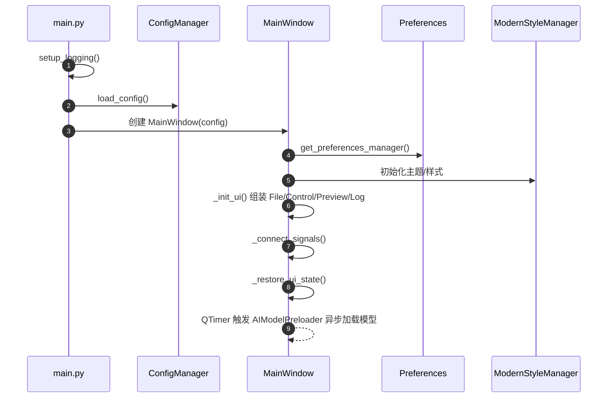
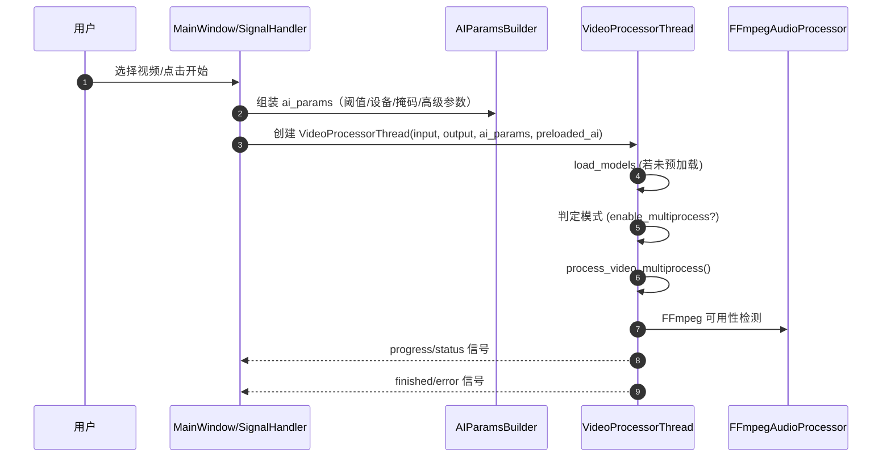
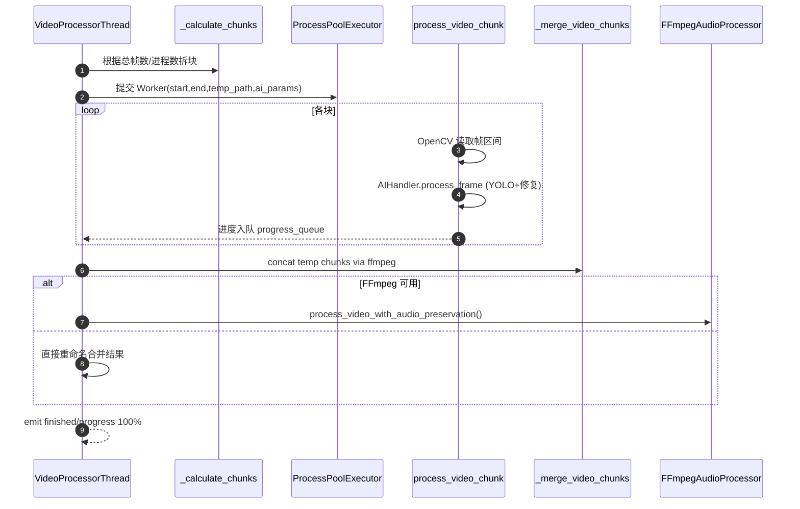
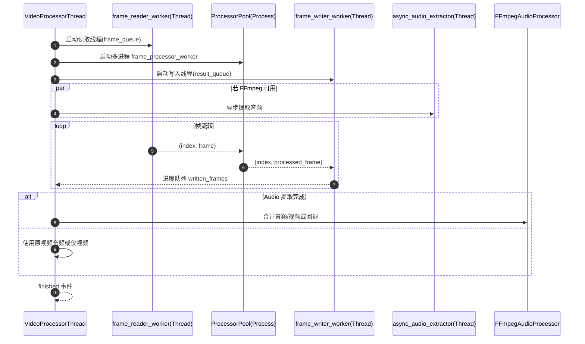
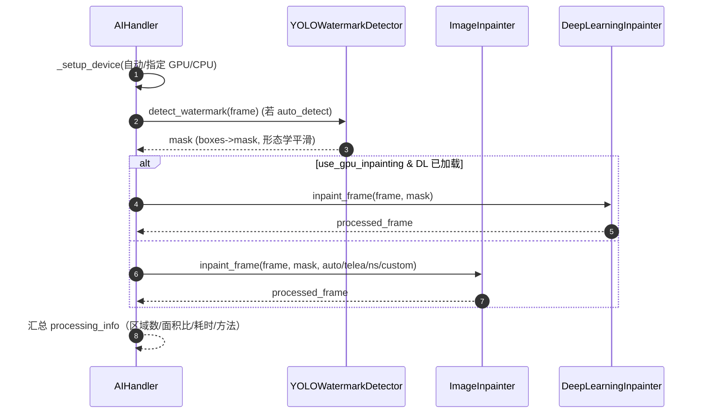
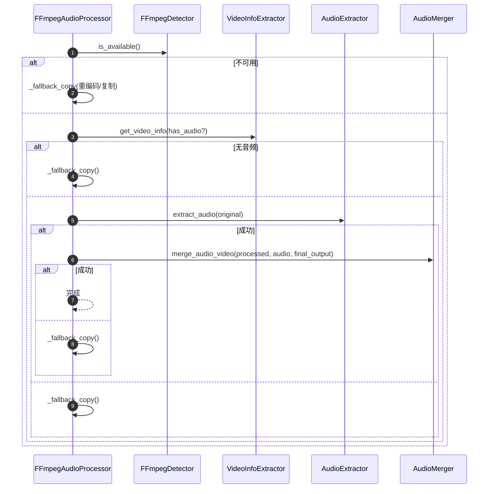
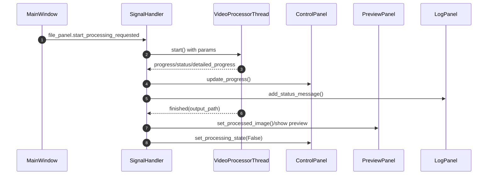

# 智能视频水印去除工具模块情况说明（2025-11-27）

## 项目概览
- 技术栈：Python + PyQt6 桌面端，核心依赖 OpenCV、PyTorch、ultralytics YOLO；通过 FFmpeg 处理音视频轨道。
- 入口：`main.py` 启动 GUI，先调用 `app.utils.logger_setup.setup_logging`，加载配置后创建 `MainWindow`。
- 配置：默认读取/写入用户配置目录的 `config.ini`，示例配置在仓库根目录的 `config.ini.example`。

## 核心能力与模块
- **AI 子系统（app/core/ai）**  
  - `ai_handler.py`：统一协调检测与修复，选择 GPU/CPU，封装 `YOLOWatermarkDetector` 和两类修复器（OpenCV `ImageInpainter`、轻量 U-Net `DeepLearningInpainter`）。支持自动/手动掩码、后处理开关、GPU 优先回落。  
  - `yolo_detector.py`：YOLOv11 水印检测封装，读取配置驱动模型选择/自动下载（依赖 `app/utils/model_downloader.py`），纯 GPU 推理，支持批量检测与 box→mask 转换。  
  - `image_inpainter.py`：OpenCV 修复，按掩码面积自适应选择 TELEA/NS/自定义插值。  
  - `dl_inpainter.py`：轻量 U-Net 修复，支持单帧/批处理，GPU 优化、可加载预训练权重。
- **视频处理管线（app/core/video）**  
  - `video_processor.py`：GUI 线程安全调度器，按文件类型分派图片处理或视频处理；支持单进程、多进程分块、流水线三种模式，带进度/状态信号。  
  - `pipeline_processor.py`：三段式流水线（读取线程→进程池处理→写入线程），动态队列尺寸、进度轮询，失败回退到分块模式。  
  - `multiprocess_processor.py`：按帧数均分块，ProcessPool + FFmpeg concat 合并，再尝试保留音频。  
  - `frame_reader.py` / `frame_processor.py` / `frame_writer.py`：对应读取、AI 处理、写入工作单元，含缓冲与顺序保证。  
  - `image_processor.py`、`single_process_processor.py`：单进程路径（未展开的文件仍存在，用于回退）。  
  - `audio_tasks.py`：流水线模式下的异步音频提取协程包装。
- **音频与 FFmpeg（app/core/audio）**  
  - `ffmpeg_audio_processor.py` 聚合检测、信息提取、提取、合并模块；可用时保持原音轨，失败回退复制或重编码。  
  - 子模块：`ffmpeg_detector.py`（检测与路径解析）、`video_info_extractor.py`、`audio_extractor.py`、`audio_merger.py`，以及简单的可用性自检。  
  - 兼容无 FFmpeg 情况：降级复制或 OpenCV 输出。

## 配置与偏好
- `app/config/config_manager.py`：统一加载/保存，默认写入用户配置目录；为 Phase3 测试提供大小写兼容 section 与默认值，提供特定配置读取（检测敏感度、修复方法、保留音频）。  
- `app/config/preferences/`：`manager.py` + `storage.py` + `validator.py` + `defaults.py` 负责 UI 偏好（窗口几何、主题、路径、处理模式等），对外由 `get_preferences_manager` 暴露。  
- `app/config/styles/`：`ModernStyleManager` 及样式 token/color/factory/sections，集中管理控件配色和组件样式片段。

## UI 层
- `app/ui/main_window.py`：组装主窗口，分栏布局（预览区 + 左侧文件/控制/日志），加载偏好与样式，延迟后台预加载 AI 模型。  
- `app/ui/signal_handler.py`：解耦业务与 UI，负责文件导入/导出、模式切换、手动选择同步、启动/停止处理、进度汇报，调用 `VideoProcessorThread`，使用 `AIParamsBuilder` 组装 AI 参数。  
- 组件与小部件：  
  - `components/`：`FilePanel`（文件选择、主题切换）、`ControlPanel`（参数与按钮）、`LogPanel`（日志展示）、`PreviewPanel`（结果/进度预览）、`DetailedProgressWidget`。  
  - `widgets/`：批处理与高级参数组件、图像选择与坐标转换、可选水印区域绘制等；`advanced/` 内有参数标签页与表单；`batch/` 提供批处理线程、UI 组合与文件管理。  
  - `ui/utils/ai_params_builder.py`：从偏好与高级参数生成 AI 参数字典（检测阈值、设备、掩码模式、批处理等）。

## 工具与脚本
- `app/utils/logger_setup.py`：统一日志输出至 `logs/watermark_remover_YYYYMMDD.log`，文件轮转+控制台警告级别。  
- `app/utils/model_downloader.py`：HuggingFace/GitHub 自动下载 YOLO 模型，带进度条与哈希校验占位。  
- PowerShell 脚本（`scripts/`）：构建、安装、启动、质量检查、测试、性能等一系列 CI/本地运维脚本；`check_code_quality.py` 为 Python 质量扫描入口。  
- 项目根：`pyproject.toml`/`setup.py`/`requirements*.txt` 定义依赖与打包；`config.ini.example` 提供配置示例。

## 数据与模型
- `models/yolo11x-watermark.pt`：预置的水印检测权重；`models/README.md` 未查看。  
- `logs/`、`test_output/`：运行输出与测试产物目录（当前内容未展开）。

## 测试与质量
- `tests/` 根下：覆盖 AI、视频流水线、GPU/E2E、预览、偏好与批处理等；存在 PS 脚本版的端到端/音频/偏好测试（`test_end_to_end.ps1` 等）。  
- 子目录：`unit/`、`integration/`、`core/`、`app/` 存放分层用例；`future/`、`test_data/` 提供占位与样例。`conftest.py` 配置夹具，`TESTING_GUIDE.md` 提供测试指导。  
- 重点用例：`test_pipeline_video.py`、`test_multiprocess_video.py`、`test_video_preview.py` 检查管线、并发与 UI 预览；`test_yolo_detector.py`、`test_yolo_pipeline.py` 校验检测与流水线；`test_phase5_gpu_e2e.py` 关注 GPU 路径。

## 其他目录
- `discuss/`：阶段总结与设计记录（多阶段方案/优化笔记）。  
- `.vscode/`、`.flake8`、`.pre-commit-config.yaml`：编辑器与静态检查配置。  
- `.venv/`、`.mypy_cache/` 等为环境/缓存目录。

## 模块协作关系（简述）
1. 主入口 `main.py` → 读取配置/日志 → `MainWindow`。  
2. `MainWindow` 通过 `SignalHandler` 驱动文件选择与处理请求；`AIModelPreloader` 异步加载模型。  
3. `SignalHandler.handle_start_processing` 组装 AI 参数 → 创建 `VideoProcessorThread`。  
4. `VideoProcessorThread` 根据文件类型选择处理路径：图片用 `process_image`，视频用单进程/多进程/流水线；每种模式内部都调用 `AIHandler` 进行检测+修复。  
5. 音频处理由 `FFmpegAudioProcessor` 负责，视频帧由 OpenCV 读写，必要时合并音轨。  
6. 处理结果/进度通过 PyQt 信号回传 UI，预览/日志组件实时更新；偏好与主题通过 preferences/styles 管理。

## 关注点与潜在检查点
- YOLO 模型自动下载依赖网络与 `models/` 权限，需在离线环境提前放置权重。  
- 多进程/流水线使用 `multiprocessing.Manager` + `ProcessPoolExecutor`，需确保 Windows 下的启动方式（入口保护）在调用场景中正确。  
- FFmpeg 可用性影响音频保留与最终编码质量，`ffmpeg_detector` 会尝试检测路径；无 FFmpeg 时自动降级。  
- GPU 路径依赖 CUDA/torch 可用性，`AIHandler` 支持自动回退到 CPU。

> 本说明未查阅任何 README.md 文件，信息来源于源码与目录结构。

## 核心流程时序图

### 应用启动与窗口构建

### GUI 发起视频处理（默认多进程分块）

### 多进程分块处理（process_video_multiprocess）

### 流水线模式（process_video_pipeline）

### AI 检测与修复（AIHandler.process_frame）

### 音频保留与回退（FFmpegAudioProcessor.process_video_with_audio_preservation）

### UI 信号流与预览更新

