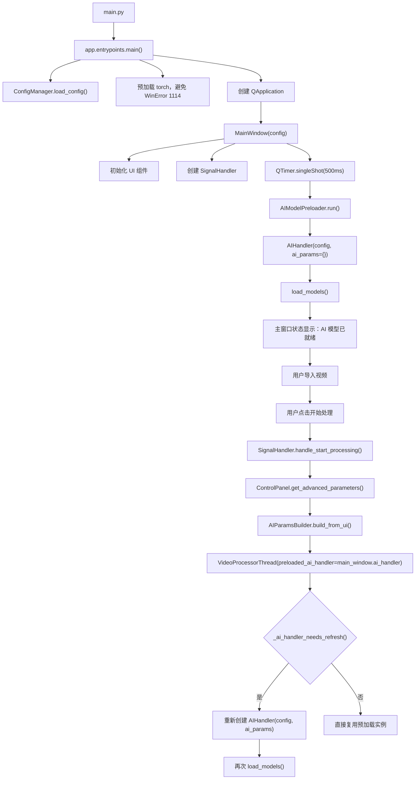
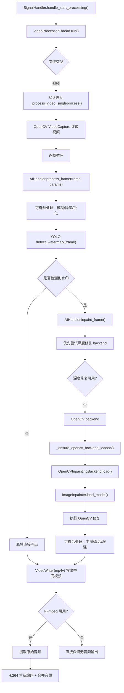
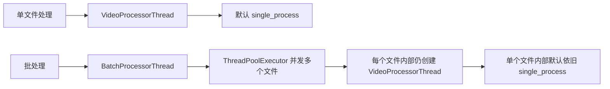

# 视频慢处理探索文档与修复计划

## 1. 背景

本次探索聚焦于以下问题：

- 启动应用后，在**现有默认参数**下处理带水印视频明显偏慢。
- 需要梳理从启动到开始处理、再到视频导出的**完整业务流逻辑图**。
- 需要给出**可执行的修复计划**，并明确优先级、影响面和验证方案。

本次结论基于以下两类证据：

- **静态证据**：`src/app` 下启动链路、参数链路、视频处理链路和音频链路源码。
- **动态证据**：`logs/watermark_remover_20260325.log` 中的真实运行日志。

说明：

- 已按项目要求尝试派发多子代理做只读探索，但当前会话对子代理结果回收不稳定。
- 因此最终结论以主线程完成的源码审查和运行日志实证为准。

---

## 2. 结论摘要

一句话结论：

**当前“默认参数下视频处理特别慢”不是单点问题，而是“预加载失效 + 单文件固定单进程逐帧 YOLO 推理 + 命中修复时重复加载 OpenCV backend + 默认推荐 LaMa 但常常先失败再降级 + 导出阶段固定二次编码”的组合问题。**

核心发现按优先级排序如下：

1. **AI 预加载几乎没有真正复用到首个处理任务。**
   - 启动时预加载使用的是 `AIHandler(config, ai_params={})`。
   - 点击开始处理后，实际任务参数来自 UI 默认值，和预加载实例存在大量差异。
   - `VideoProcessorThread.run()` 会命中 `_ai_handler_needs_refresh()`，然后**重新创建 `AIHandler` 并再次 `load_models()`**。
   - 用户看到“AI 模型已就绪”，但首个任务仍然冷启动。

2. **单文件视频处理默认固定走 `single_process`，性能参数里的线程数和 YOLO `batch_size=8` 基本没有发挥作用。**
   - `SignalHandler.handle_start_processing()` 创建 `VideoProcessorThread` 时没有传入 `enable_multiprocess`、`num_processes`、`use_pipeline`。
   - 结果默认总是 `Using single-process mode`。
   - `single_process.py` 中逐帧调用 `AIHandler.process_frame()`。
   - `YOLOWatermarkDetector.detect_batch()` 虽然存在，但默认单文件路径并不会调用。

3. **命中水印修复时，会在每帧里重复触发 OpenCV backend 的 `load()`。**
   - `AIHandler.inpaint_frame()` 每次修复前都会调用 `_ensure_opencv_backend_loaded()`。
   - `_ensure_opencv_backend_loaded()` 又会调用 `opencv_inpainting_backend.load()`。
   - `OpenCVInpaintingBackend.load()` 每次都会执行 `image_inpainter.load_model()`。
   - 日志里能看到大量重复的 `Loading lightweight image inpainting model...`。

4. **默认 UI 推荐 LaMa 深度修复，但多数默认环境并没有预先配置 LaMa 路径，任务开始时会先尝试深度修复再降级到 OpenCV。**
   - 这会额外增加首任务初始化成本。
   - 也会让“默认参数”给用户一种已经开启高性能深度修复的错觉。

5. **视频输出固定采用 `mp4v` 中间文件，再用 FFmpeg 重新编码成 H.264 并合并音频。**
   - 这会增加一次完整输出 pass。
   - 虽然在当前日志样本里不是主耗时，但它是明确的额外成本。
   - 且当前实现没有尊重 `preserve_audio`、`compression_quality` 等用户可见参数。

6. **逐帧 INFO 日志过多，会放大 I/O 开销并干扰定位。**
   - 每帧至少会产生“自动检测”“无水印/有水印”日志。
   - 命中修复时还会追加 OpenCV backend 加载日志。

---

## 3. 业务流逻辑图

### 3.1 启动到首个任务的主链路

### 3.2 单文件视频默认处理链路

### 3.3 批处理链路与单文件链路的差异

结论：

- 当前批处理的“并发”主要是**多个文件并发**。
- 单个视频文件内部默认并没有把“多进程 / 流水线 / batch detect”真正启用到用户入口。

---

## 4. 关键证据

### 4.1 预加载模型失效，首任务重新冷启动

源码证据：

- `src/app/ui/main_window.py:47-48`
  - 预加载线程创建的是 `AIHandler(self.config, ai_params={})`。
- `src/app/core/video/thread.py:288-295`
  - 若关键参数变化，则重新创建 `AIHandler` 并重新 `load_models()`。
- `src/app/core/video/thread.py:21-32`
  - 刷新判定包含 `device`、`requested_inpainting_backend`、`quality_level`、`min_area_pixels` 等多个字段。
- `src/app/ui/widgets/advanced/advanced_parameters_widget.py:409-432`
  - UI 默认值并不是空参数，而是一整套显式默认参数。

日志证据：

- `logs/watermark_remover_20260325.log:145-149`
  - 线程初始化后明确打印“使用预加载的AI模型”。
- 紧接着 `logs/watermark_remover_20260325.log:149`
  - 又打印 `预加载 AIHandler 参数已变化，重新加载以匹配当前任务`。
- 随后 `logs/watermark_remover_20260325.log:162-164`
  - 重新执行 `Loading AI models...` 和 `Loading YOLO model...`。

结论：

- 当前预加载优化对首任务几乎无效。

### 4.2 单文件默认固定单进程，线程参数没有落到处理策略

源码证据：

- `src/app/ui/utils/ai_params_builder.py:203-205`
  - `thread_count` 被转换成了 `num_processes`。
- `src/app/ui/signal_handler.py:332-338`
  - 创建 `VideoProcessorThread` 时只传了 `input_path`、`output_path`、`ai_params`、`config`、`preloaded_ai_handler`。
  - **没有传 `num_processes`、`enable_multiprocess`、`use_pipeline`。**
- `src/app/core/video/thread.py:193-195`
  - `VideoProcessorThread` 本来支持 `enable_multiprocess`、`num_processes`、`use_pipeline`。
- `src/app/core/video/thread.py:317-319`
  - 默认分支就是 `Using single-process mode`。
- `src/app/core/video/modes/single_process.py:54-88`
  - 逐帧读取、逐帧 `process_frame()`、逐帧写出。

日志证据：

- `logs/watermark_remover_20260325.log:180`
  - `Using single-process mode`
- `logs/watermark_remover_20260325.log:2223`
  - `Using single-process mode`
- `logs/watermark_remover_20260325.log:2496`
  - `Using single-process mode`

结论：

- 用户界面上的“线程数 / GPU batch_size”与默认单文件视频性能之间，目前基本是脱节的。

### 4.3 `batch_size=8` 默认值并没有进入默认单文件路径

源码证据：

- `src/app/core/ai/yolo_detector.py:96`
  - 默认 `batch_size = 8`。
- `src/app/core/ai/yolo_detector.py:306-359`
  - 批量检测只在 `detect_batch()` 中实现。
- 当前默认单文件链路实际调用的是：
  - `src/app/core/ai/ai_handler.py:414`
  - `self.watermark_detector.detect_watermark(frame)`

结论：

- 对单文件默认路径来说，`batch_size=8` 只是模型配置值，不等于“默认会 8 帧并推”。

### 4.4 命中修复时每帧重复加载 OpenCV backend

源码证据：

- `src/app/core/ai/ai_handler.py:614`
  - 每次修复都调用 `_ensure_opencv_backend_loaded()`。
- `src/app/core/ai/ai_handler.py:746-760`
  - `_ensure_opencv_backend_loaded()` 无论 backend 是否已创建，都会执行 `self.opencv_inpainting_backend.load()`。
- `src/app/core/ai/inpainting_backends/opencv_backend.py:27-33`
  - `load()` 每次都调用 `self.image_inpainter.load_model()`。
- `src/app/core/ai/image_inpainter.py:87-102`
  - `load_model()` 会打印加载日志并设置 `self.inpainting_model = "opencv_inpaint"`。

日志证据：

- `logs/watermark_remover_20260325.log:170-172`
  - 任务开始时加载一次 OpenCV 修复器。
- 随后在处理过程中又反复出现：
  - `logs/watermark_remover_20260325.log:2071-2073`
  - `logs/watermark_remover_20260325.log:2076-2078`
  - `logs/watermark_remover_20260325.log:2231-2232`

结论：

- 这说明 OpenCV backend 的“已加载”状态没有被正确缓存。
- 即使 `load_model()` 本身很轻，也会引入无意义调用、日志 I/O 和状态判断开销。

### 4.5 默认推荐 LaMa，但缺少路径时会先尝试再降级

源码证据：

- `src/app/ui/widgets/advanced/advanced_parameters_widget.py:418`
  - 默认修复方法是 `LaMa 深度学习修复（推荐）`。
- `src/app/ui/widgets/advanced/advanced_parameters_widget.py:425`
  - 默认 `enable_gpu = True`。
- `src/app/ui/utils/ai_params_builder.py:147-174`
  - 默认会把该组合转成 `requested_inpainting_backend=lama`，并启用 `use_gpu_inpainting`。
- `src/app/core/ai/inpainting_backends/lama_backend.py:66-67`
  - 缺少 LaMa 路径时会返回 `missing_lama_model_path`。

日志证据：

- `logs/watermark_remover_20260325.log:2218-2220`
  - 任务开始时先尝试加载深度修复，再提示“未配置 LaMa 模型路径，当前改用 OpenCV 修复”。

结论：

- 这会制造额外初始化成本。
- 更重要的是，它让默认参数与实际生效路径存在认知偏差。

### 4.6 即使 LaMa 已配置，默认路径仍然很慢

日志证据：

- `logs/watermark_remover_20260325.log:2480`
  - `configured_inpainting_asset_ref=C:\cascadeProjects\video_watermark_remover\models\big-lama.pt`
- `logs/watermark_remover_20260325.log:2493-2495`
  - 已成功加载 `LaMa TorchScript`
- `logs/watermark_remover_20260325.log:2497`
  - 视频为 `460` 帧，`30fps`
- `logs/watermark_remover_20260325.log:3427`
  - `11:43:35` 开始，`11:57:00` 完成，共约 `805` 秒。

推导：

- 460 帧 / 805 秒 ≈ **0.57 帧/秒**
- 原视频时长约 460 / 30 ≈ **15.3 秒**
- 实际耗时约为原视频时长的 **52 倍**

结论：

- 即便 LaMa 真正生效，**默认单文件逐帧链路本身仍然是慢的**。
- 因此问题不只是“没有配上 LaMa”，而是**处理策略本身不对**。

### 4.7 音频回写和 H.264 重新编码是固定附加成本

源码证据：

- `src/app/core/video/modes/single_process.py:32-33`
  - 先用 OpenCV `mp4v` 写中间视频。
- `src/app/core/video/modes/single_process.py:136-150`
  - 只要 FFmpeg 可用，就进入音频保留流程。
- `src/app/core/audio/ffmpeg_audio_processor.py:192-202`
  - 明确使用 `libx264 + aac` 重新编码。
- `src/app/core/audio/audio_merger.py:81-85`
  - 执行 FFmpeg 合并命令。

额外问题：

- `ConfigManager.preserve_audio()` 虽然存在，但当前主链路没有使用它。
- `compression_quality`、`output_format` 等 UI 参数在视频链路里也没有真正生效。

结论：

- 这不是当前主耗时，但属于明确的“永远多做了一步”。
- 同时还带来了“用户改了参数但处理链路不变”的配置失真问题。

### 4.8 运行日志已经足够证明“特别慢”

样本 1：

- `logs/watermark_remover_20260325.log:145-180`
  - `1.mp4` 开始处理。
- `logs/watermark_remover_20260325.log:2088`
  - `539/539 frames processed`
- 起止时间：`09:25:05 -> 09:40:31`
- 总耗时约：`926 秒`
- 处理速度约：`1.72 帧/秒`
- 原视频时长约：`18 秒`

样本 2：

- `logs/watermark_remover_20260325.log:2464-2497`
  - `2.mp4` 开始处理。
- `logs/watermark_remover_20260325.log:3427`
  - `460/460 frames processed`
- 起止时间：`11:43:35 -> 11:57:00`
- 总耗时约：`805 秒`
- 处理速度约：`0.57 帧/秒`
- 原视频时长约：`15.3 秒`

样本 3：

- `logs/watermark_remover_20260325.log:2190-2232`
  - `20251005.mp4` 开始后，几十秒内仅推进到少量逐帧日志。
- `logs/watermark_remover_20260325.log:2365`
  - 用户主动停止。

结论：

- “特别慢”不是主观感觉，日志里已经形成了稳定复现。

---

## 5. 根因归纳

可以把当前慢处理问题归纳成三层：

### 第一层：入口层问题

- 预加载实例和实际任务参数不一致。
- 首个任务仍然完整冷启动。

### 第二层：处理策略问题

- 单文件默认固定单进程。
- `thread_count`、`num_processes`、`use_pipeline` 没有从 UI 真正打通到线程构造。
- YOLO `detect_batch()` 没有进入默认路径。

### 第三层：执行细节问题

- 修复 backend 重复加载。
- LaMa 默认推荐但常常先失败再降级。
- 每帧 INFO 级日志过多。
- 视频输出固定二次编码和音频回写。

最终判断：

**主根因是“默认处理策略没有走高吞吐路径”，其余问题负责把本来就慢的链路进一步放大。**

---

## 6. 修复计划

下面按“收益 / 风险 / 实施复杂度”排序。

### 阶段一：高收益、低到中风险，优先立刻做

#### 6.1 修复预加载失效

目标：

- 让“AI 模型已就绪”真正等价于“首个任务不会再整套重建”。

建议做法：

1. 不再用 `ai_params={}` 预加载 `AIHandler`。
2. 在主窗口完成默认参数组件初始化后，构建一次**真实默认参数快照**。
3. 预加载时就使用这份默认参数。
4. `_ai_handler_needs_refresh()` 比较的字段改成**归一化后的关键字段集合**，避免无意义刷新。

建议优先文件：

- `src/app/ui/main_window.py`
- `src/app/ui/utils/ai_params_builder.py`
- `src/app/core/video/thread.py`

预期收益：

- 直接消除首任务的二次 `load_models()`。

#### 6.2 打通单文件视频的多进程 / 流水线策略

目标：

- 让 UI 的性能参数真正控制视频处理策略。

建议做法：

1. 在 `SignalHandler.handle_start_processing()` 中，把 `ai_params["num_processes"]` 显式传给 `VideoProcessorThread`。
2. 新增策略选择：
   - 短视频、小分辨率：可保留 single-process
   - 中长视频：默认 `enable_multiprocess=True`
   - 有 GPU 且帧数较多：默认 `use_pipeline=True`
3. 给用户一个明确的“处理策略”显示，而不是只显示线程数。

建议优先文件：

- `src/app/ui/signal_handler.py`
- `src/app/core/video/thread.py`
- `src/app/ui/widgets/advanced/tabs/performance_tab.py`

预期收益：

- 这是最大头的吞吐提升点。

#### 6.3 修复 OpenCV backend 重复加载

目标：

- 避免命中修复时每帧重复 `load()`。

建议做法：

1. 在 `OpenCVInpaintingBackend` 中增加 `_loaded` 状态。
2. `load()` 只在首次调用时执行 `image_inpainter.load_model()`。
3. `AIHandler._ensure_opencv_backend_loaded()` 只负责“确保已创建且已加载”，不要每次重新 load。

建议优先文件：

- `src/app/core/ai/inpainting_backends/opencv_backend.py`
- `src/app/core/ai/ai_handler.py`
- `src/app/core/ai/image_inpainter.py`

预期收益：

- 去掉逐帧重复初始化和多余日志，是稳定且低风险的优化。

#### 6.4 把缺失 LaMa 路径的判定前置

目标：

- 不要等用户点击开始处理后才知道“推荐 backend 实际不可用”。

建议做法：

1. 启动预加载阶段就检查 LaMa / U-Net 资源是否可用。
2. 若默认推荐 backend 不可用：
   - UI 上提前标注“当前将回退到 OpenCV”
   - 或直接把默认值调整为 OpenCV Auto
3. 只在真正可用时才默认选 LaMa。

建议优先文件：

- `src/app/ui/main_window.py`
- `src/app/core/ai/inpainting_backends/lama_backend.py`
- `src/app/ui/widgets/advanced/advanced_parameters_widget.py`

预期收益：

- 降低首任务初始化抖动。
- 减少“默认值误导”。

#### 6.5 下调逐帧日志级别

目标：

- 把每帧 INFO 改成 DEBUG，仅保留阶段级日志。

建议优先文件：

- `src/app/core/ai/ai_handler.py`
- `src/app/core/ai/image_inpainter.py`

预期收益：

- 减少日志 I/O 噪音，提升可观测性质量。

### 阶段二：中期优化，收益高但改动更大

#### 6.6 在单文件路径启用帧批量检测

目标：

- 真正利用 `YOLOWatermarkDetector.detect_batch()` 和 `batch_size=8`。

建议做法：

1. 在 pipeline 或 single-process 中引入“小批量帧读取”。
2. 先批量做检测，再按结果分别修复和写出。
3. 若修复阶段仍是逐帧，也至少先把检测阶段吞吐拉上来。

建议优先文件：

- `src/app/core/video/modes/pipeline.py`
- `src/app/core/video/modes/single_process.py`
- `src/app/core/ai/yolo_detector.py`

#### 6.7 让音频与输出参数真正生效

目标：

- 用户改参数，链路就要真的变化。

建议做法：

1. 在视频链路里尊重 `preserve_audio`。
2. 若用户关闭保音，直接跳过音频提取与合并。
3. 把 `compression_quality` 映射到 FFmpeg 的 `crf/preset` 或码率参数。
4. 重新审视是否必须始终先写 `mp4v` 再转 H.264。

建议优先文件：

- `src/app/core/video/modes/single_process.py`
- `src/app/core/video/modes/pipeline.py`
- `src/app/core/video/modes/multiprocess.py`
- `src/app/core/audio/ffmpeg_audio_processor.py`
- `src/app/core/audio/audio_merger.py`

### 阶段三：长期优化

#### 6.8 做策略自动选择

目标：

- 根据视频长度、分辨率、设备和 backend 可用性，自动选择最佳处理模式。

建议规则示例：

- 帧数 < 120：single-process
- 120 <= 帧数 < 600：pipeline
- 帧数 >= 600：pipeline 或 multiprocess
- GPU 不可用且分辨率很高：优先 pipeline + 较小批量

#### 6.9 增加性能基准和回归门禁

目标：

- 以后改动性能链路时能第一时间发现退化。

建议：

- 新增 `tests/perf` 或 `scripts` 下基准脚本。
- 固定测：
  - 模型初始化时间
  - 前 30 帧平均检测耗时
  - 前 30 帧平均修复耗时
  - 首任务总启动时间

---

## 7. 推荐实施顺序

推荐按下面顺序推进：

1. 先修 **预加载失效**。
2. 再修 **单文件默认固定单进程**。
3. 然后修 **OpenCV backend 重复加载**。
4. 同时把 **缺失 LaMa 路径的判定前置**。
5. 最后处理 **音频/输出参数真实生效** 和 **批量检测优化**。

原因：

- 1 和 2 决定了主吞吐。
- 3 是低风险高回报。
- 4 可以减少默认路径抖动和误导。
- 5 属于体验和一致性修复。

---

## 8. 最小测试与验证计划

### 8.1 单元测试

建议新增或补强以下测试：

- 预加载参数与默认参数一致时，`VideoProcessorThread` 不应重建 `AIHandler`
- `SignalHandler.handle_start_processing()` 会把 `num_processes / enable_multiprocess / use_pipeline` 传入线程
- `OpenCVInpaintingBackend.load()` 多次调用只初始化一次
- 缺失 LaMa 资源时，启动前即可得到明确状态，而不是任务运行时才降级
- `preserve_audio=False` 时不会进入 FFmpeg 合并流程

### 8.2 集成测试

- 选取固定 30 帧视频样本，比较修复前后：
  - 首任务初始化时间
  - 前 30 帧总耗时
  - 平均帧速
- 断言优化后：
  - 不再出现首任务二次 `load_models()`
  - 不再出现逐帧 `Loading lightweight image inpainting model...`

### 8.3 日志验证

优化完成后，理想日志应满足：

- 首任务开始时不再出现 `预加载 AIHandler 参数已变化，重新加载以匹配当前任务`
- 视频任务不再固定打印 `Using single-process mode`
- 每帧不再刷 INFO 级别“无水印/有水印”日志

---

## 9. 最终判断

当前实现的问题不在于“模型不够强”，而在于：

- **启动预热和真正处理之间没有打通**
- **默认视频策略没有走高吞吐路径**
- **部分默认参数只是 UI 默认，不是实际运行默认**

如果只做小修小补，例如只改一个阈值、只切换一次 LaMa、只减少一点日志，用户体感不会有本质变化。

要想真正解决“默认参数下处理特别慢”，至少要同时完成这三件事：

1. **让预加载真的可复用**
2. **让单文件视频默认进入并行/流水线路径**
3. **去掉逐帧重复 backend load**

这三项做完之后，再去细调 YOLO 批量检测、LaMa 策略和音频导出，收益会更明显。
